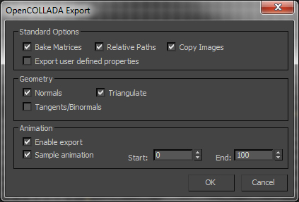
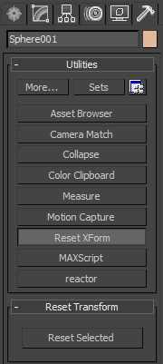
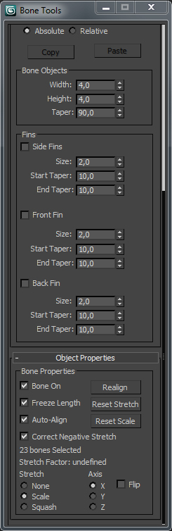

Export procedure
----------------

To export your scene as a Collada file from 3D Studio Max, start by going to File-> Export. If you want to export only the selected scene node, chose "Export Selected", otherwise simply click "Export". You should now see the "Select File to Export" dialog box. In the type drop down box, select the exporter you want to use:

-   Autodesk Collada
-   OpenCOLLADA (you have to download and install the [OpenCOLLADA](http://opencollada.org/) plugin first)

The Autodesk Collada will work fine in most cases but it does not handle instances properly and will use copies instead. This is likely to make your exported file much heavier if your original scene relies on instances a lot. In this case, you should use the OpenCOLLADA exporter.

Then, click on the "Save" button.

### Options for the Autodesk Collada exporter

-   In the Geometry panel, uncheck the "Convert Deforming Dummies to Bones" checkbox.
-   In the Animation panel, check the "Animation" checkbox if you want to export animations and make sure:
    -   The "Bake Animation" checkbox is selected
    -   The "Start" and "End" timers are set to the stard/end frames of your animation
-   In the Camera panel, check the "Camera" checkbox if you want to export cameras.
-   In the Lights panels, check the "Lights" checkbox if you want to export lights.
-   In the Advanced Options-> Collada panel, make sure:
    -   The "Triangulate" and "Single Matrix" checkbox are selected
    -   The "Frame Rate" input is set to the actual desired frame rate of your application

### Options for the OpenCOLLADA exporter

-   In the Standard Options panel, make sure that the "Bake Matrices" checkbox is selected. If your file uses textures and you want to ease their loading at runtime or in the editor, make sure the "Relative Paths" and "Copy Images" checkboxes are selected.
-   In the Geometry panel, make sure the "Triangulate" checkbox is selected for better performances at runtime.
    -   If your scene uses custom normals (generated using smoothing groups for example), select the "Normals" checkbox.
    -   If your scene relies on per-vertex tangents (for normal mapping for example), select the "Tangents" checkbox to skip the tangents computations at runtime. You might want to test both cases since computing tangents at runtime might be faster than reading them from the Collada file.
-   In the Animation panel:
    -   Select the "Enable export" checkbox if you want to export animations.
    -   Make sure the "Start" and "End" timer indicate the first/last frame to export.

Recommendations
---------------

### Backface culling

Disabling backface culling should always be avoided when working for real-time applications. It is computationally expensive and can easily be avoided at asset production time by flipping triangles properly. Some elements might look “inside out” when using backface culling. In order to make sure faces have the proper winding, select the corresponding mesh and use the "ResetXForm" tool in the utilities tab:

#Select the mesh #Go to the utilities tab #Select the "Reset XForm" tool #Click on "Reset Selected" button

After clicking "Reset Selected", you should see all the faces with a reversed winding. To flip those faces, start by collapsing the modifiers stack and then select those faces and click on the "Flip" button in the "Edit Polygons" panel.

### Multi-materials

Multi-materials are not easily compatible with real-time hardware accelerate 3D graphics and are **not supported** by Minko. Therefore, meshes using "multi materials" will be split and will result in one mesh per material at runtime.

### Scene complexity

The more meshes, the more computationally expensive the rendering. Working with a limited amount of mehes – by merging some of them for example - reduces CPU usage and has little impact on the GPU:

-   Try to merge meshes when possible.
-   Try to avoid unnecessary groups and scene hierarchy level as much as possible.
-   Try to apply the “one mesh => one texture” logic as much as possible. The same texture can still be used on many different meshes though (for example, all seats of a car could be merged as one big mesh, and use the same textures).

### Rigging

When creating bones using the "Mirror" tool or the "Mirror" button in the "Bone Tools" (Animation-> Bone Tools...), make sure their scale is reset:

#Select the mirrored bones (selecting all the bones of the skeleton should work fine too) #Open the "Bone Tools" in Animation-> Bone Tools... #Click on the "Reset Scale" button in the "Object Properties" panel

### Skinning

Minko provides different skinning methods:

| Skinning type                     | Max. influences | Max. number of joints | Support scales | Performances |
|-----------------------------------|-----------------|-----------------------|----------------|--------------|
| Hardware matrix skinning          | 8               | 25                    | Yes            | Best         |
| Hardware dual-quaternion skinning | 8               | 50                    | No             | Good         |
| Software matrix skinning          | Infinite        | Infinite              | Yes            | Worst        |

Minko will fallback using the most appropriate skinning type according to the skin setup, especially the number of joints and whether they are using scales or not. In order to get the best performances, try to keep the number of joints per skin as low as possible and avoid using scales for their transforms.

Supported features
------------------

### Supported scene nodes

-   Mesh
-   Group

### Supported material properties

| 3D Studio Max material property | Minko material property | Description                                                                                                                                |
|---------------------------------|-------------------------|--------------------------------------------------------------------------------------------------------------------------------------------|
| Diffuse                         | diffuseColor            | The color to use for rendering when the diffuseMap property is not set.                                                                    |
| Specular, Specular level        | specular                | The color of the specular hightlights. The value of this property is the "Specular" color pre-multiplied by the "Specular level" property. |
| Glossiness                      | shininess               | The strength of the specular highlights.                                                                                                   |
| Reflection-> Amount            | reflectivity            | The strength of the static reflection given by the "Reflection" map.                                                                       |

| 3D Studio Max map name | Minko material property | Description                                                                                             |
|------------------------|-------------------------|---------------------------------------------------------------------------------------------------------|
| Diffuse Color          | diffuseMap              | An optionnal diffuse texture to use for rendering. If it is not set, the diffuseColor property is used. |
| Specular Level         | specularMap             |                                                                                                         |
| Opacity                | alphaMap                | An optionnal texture providing per-pixel alpha values for the diffuse color value.                      |
| Bump                   | normalMap               | An optionnal texture providing per-pixel tangent space normals.                                         |
| Reflection             | environmentMap          | An optionnal texture providing per-pixel static reflections.                                            |

