Creating the material
---------------------

To create a `phongMaterial`, we simply call `material::PhongMaterial::create` method that returns a `material::PhongMaterial::Ptr`.

```cpp
auto phongMaterial = material::PhongMaterial::create();
```


You'll find more information about the `phongMaterial` in this tutorial [Working with the PhongMaterial](../tutorial/11-Working_with_the_PhongMaterial.md)

Properties of the phong material
--------------------------------

We'll show the different properties of the `phongMaterial` on three different scenes.

Each set of properties has a dedicated tutorial in the **tutorials** section:

-   [Working with the PhongMaterial](../tutorial/11-Working_with_the_PhongMaterial.md), to create a PhongMaterial then change the `diffuseColor`, `diffuseMap`, `specularColor` and the `shininess`
-   [Working with normal maps](../tutorial/12-Working_with_normal_maps.md)
-   [Working with specular maps](../tutorial/14-Working_with_specular_maps.md)
-   [Working with environment maps](../tutorial/13-Working_with_environment_maps.md)

The `phongMaterial` has access to a `diffuseColor` and a `diffuseMap`. Those properties can be set in the same way than the `basicMaterial` ([Working with the BasicMaterial](../tutorial/10-Working_with_the_BasicMaterial.md)).

| Right                                                                                    | Left                                                                       | Front                                                                        |
|------------------------------------------------------------------------------------------|----------------------------------------------------------------------------|------------------------------------------------------------------------------|
|  |  |  |

### Specular Color

Specular color is the color of the light specular reflection. The default value is white.

```cpp
phongMaterial->specularColor(0xFF0000FF);
```


| specular color | Right                                                                        | Left                                                                         | Front                                                                        |
|----------------|------------------------------------------------------------------------------|------------------------------------------------------------------------------|------------------------------------------------------------------------------|
| 0xFF0000FF     |      |      |      |
| 0xC0FFC0FF     |  |  |  |

To have more information about specular color : [Working with the PhongMaterial](../tutorial/11-Working_with_the_PhongMaterial.md)

### Shininess

Empirically, the shininess parameter controls how sharp specular reflections will look across the surface of the object. The default value is 8.

```cpp
phongMaterial->shininess(32.f);
```


| shininess | Right                                                                      | Left                                                                       | Front                                                                      |
|-----------|----------------------------------------------------------------------------|----------------------------------------------------------------------------|----------------------------------------------------------------------------|
| 2         |  |  |  |
| 16        |    |    |    |
| 64        |    |    |    |

To have more information about shininess : [Working with the PhongMaterial](../tutorial/11-Working_with_the_PhongMaterial.md)

### Environment Map & Environment Alpha

The environment alpha indicates the percentage of environment map that should be mixed with the computed color. The environment map is a texture that represents the environment around your scene.

```cpp
// first of all, we need a environment map. We add a new asset to the loading queue.

sceneManager->assets()->queue("texture/envmap.jpg");

// when all assets are loaded

phongMaterial->environmentMap(assets->texture("texture/envmap.jpg"), render::EnvironmentMap2dType::BlinnNewell); phongMaterial->environmentAlpha(0.2f);
```


| Environment Alpha                                                          | 0.2                                                            | 0.5                                                            | 0.95                                                           |
|----------------------------------------------------------------------------|----------------------------------------------------------------|----------------------------------------------------------------|----------------------------------------------------------------|
|  |  |  |  |

If you need more information about environment map : [Working with environment maps](../tutorial/13-Working_with_environment_maps.md)

### Normal Map

```cpp
// first of all, we need a normal map. We add a new asset to the loading queue.

sceneManager->assets()->queue("texture/normalmap.jpg");

// when all assets are loaded in the handler function of assets->complete()

phongMaterial->normalMap(assets->texture("texture/normalmap.jpg"));
```

| DiffuseMap / NormalMap | Right           | Left           | Front          |
|------------------------|-----------------|----------------|----------------|
|   |  |  |  |  |
  |  |  |  |  |
  |  |  |  |  |

If you need more information about normal mapping : [Working with normal maps](../tutorial/12-Working_with_normal_maps.md)

### Specular Map

```cpp
phongMaterial->shininess(2); phongMaterial->specularMap(assets->texture("texture/specularmap.jpg"));
```
| DiffuseMap / SpecularMap | Right           | Left           | Front          |
|------------------------|-----------------|----------------|----------------|
| 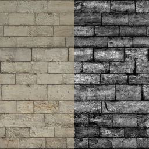                         | 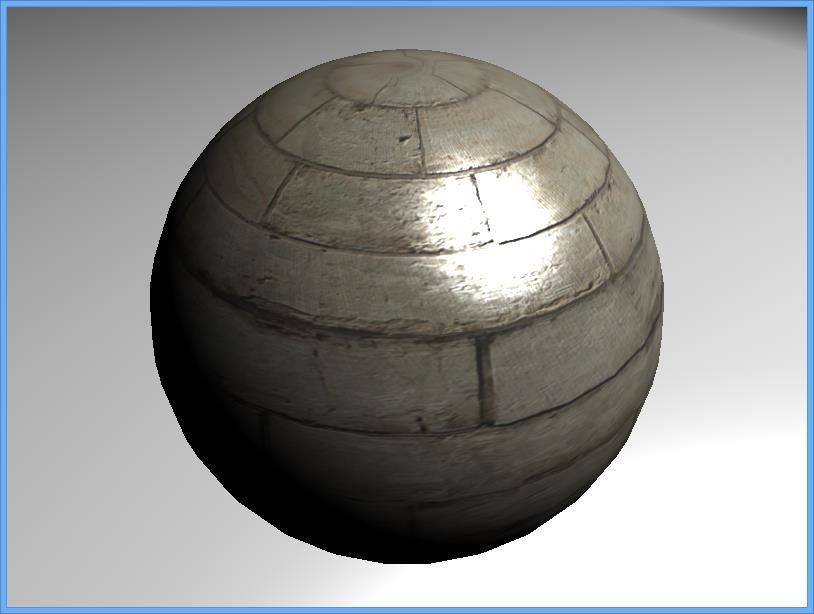 | 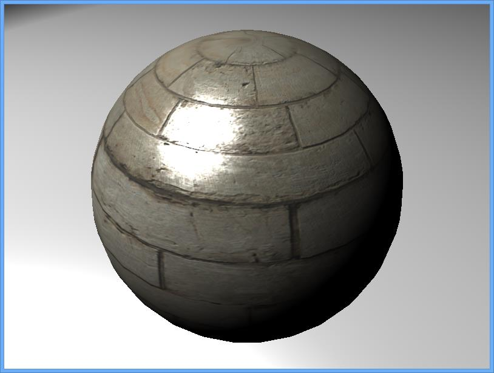 | 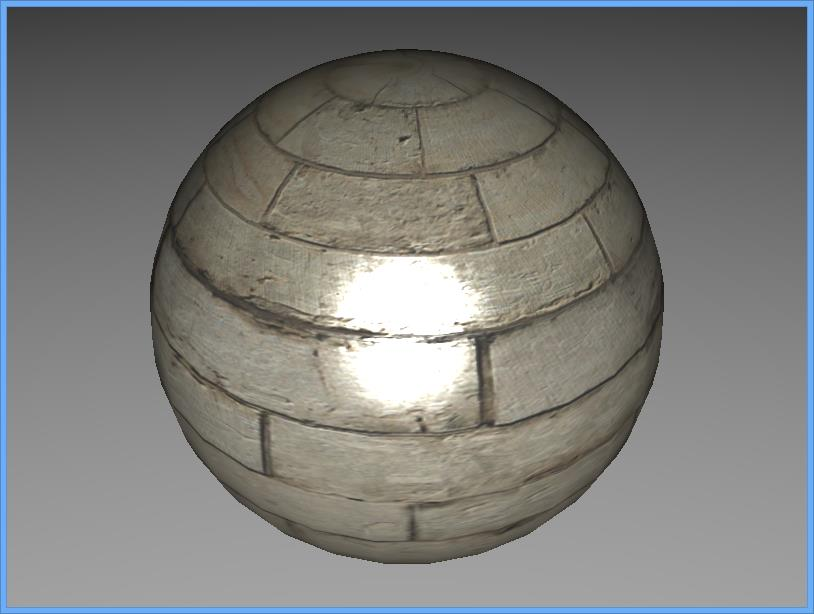 |
| 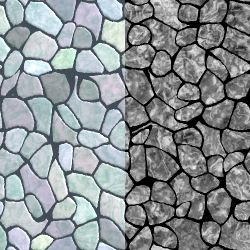                        | 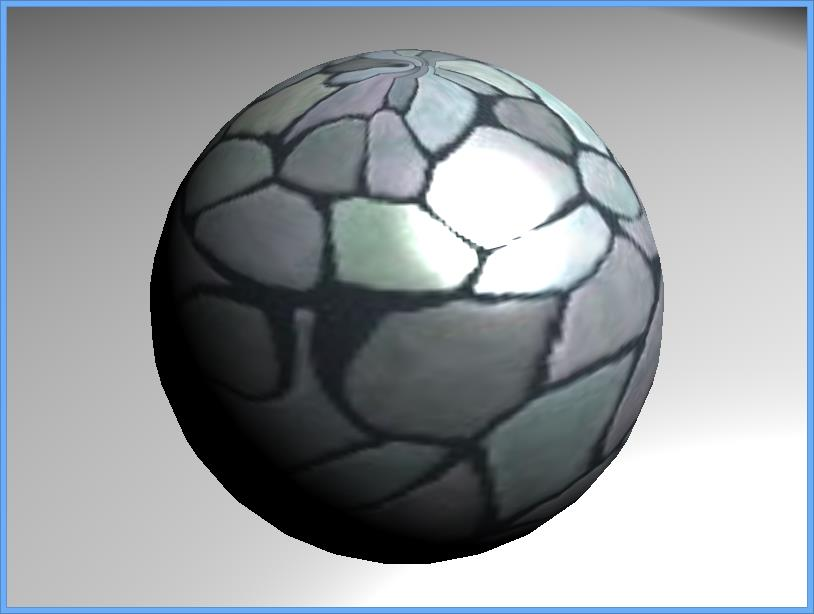 | 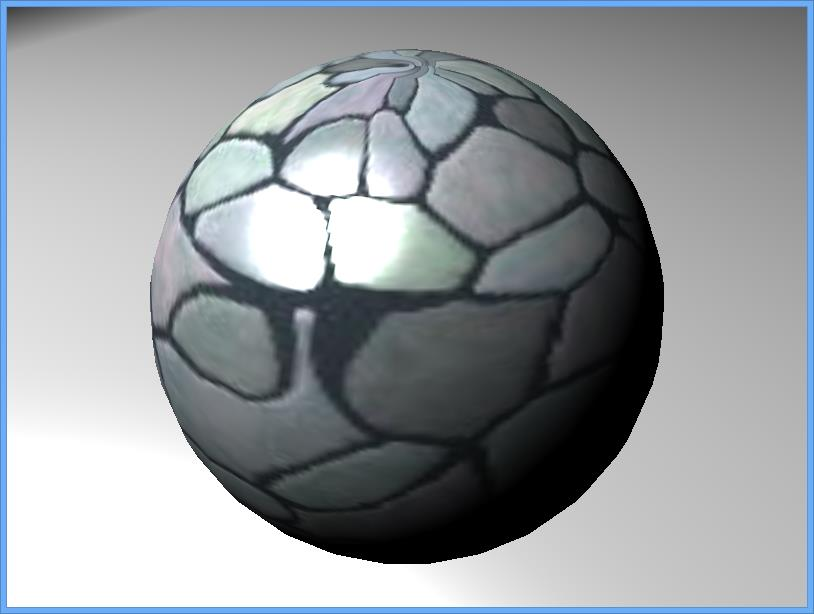 | 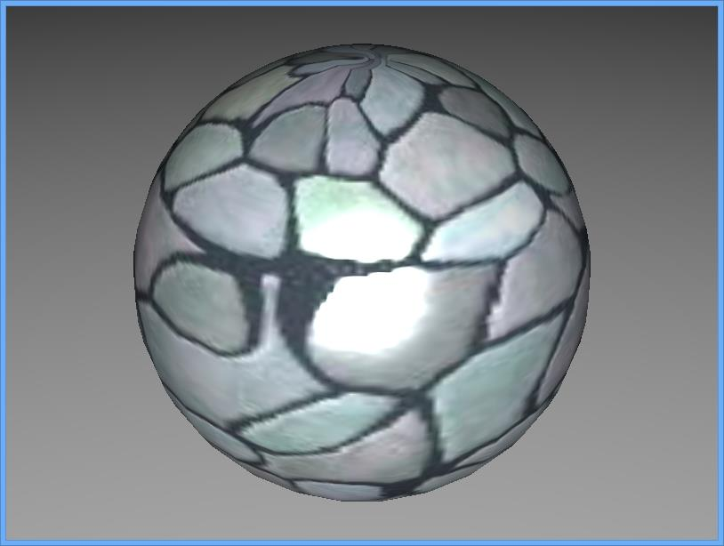 |
| 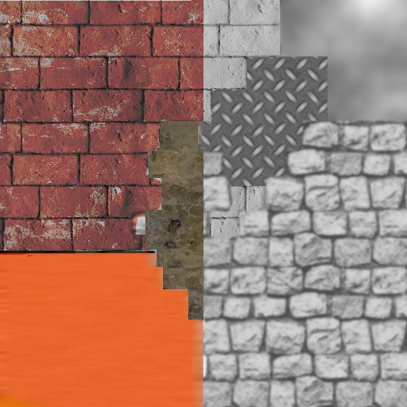 | 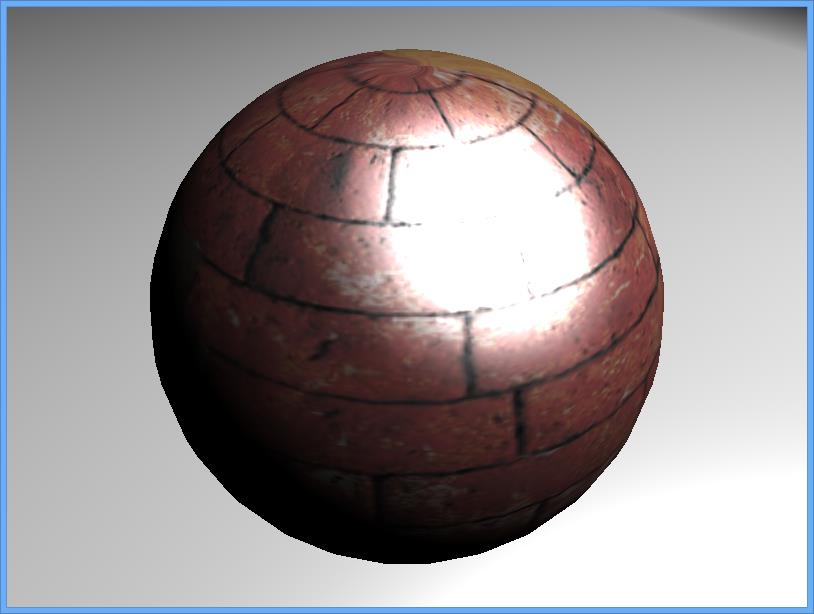 | 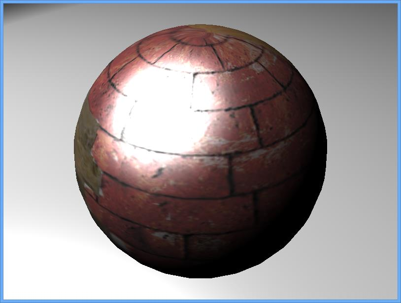 | 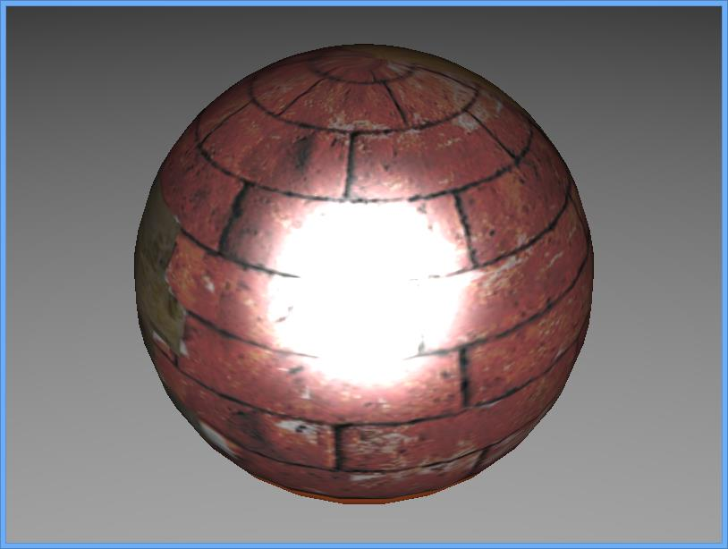 |
||

If you need more information about specular maps : [Working with specular maps](../tutorial/14-Working_with_specular_maps.md)
