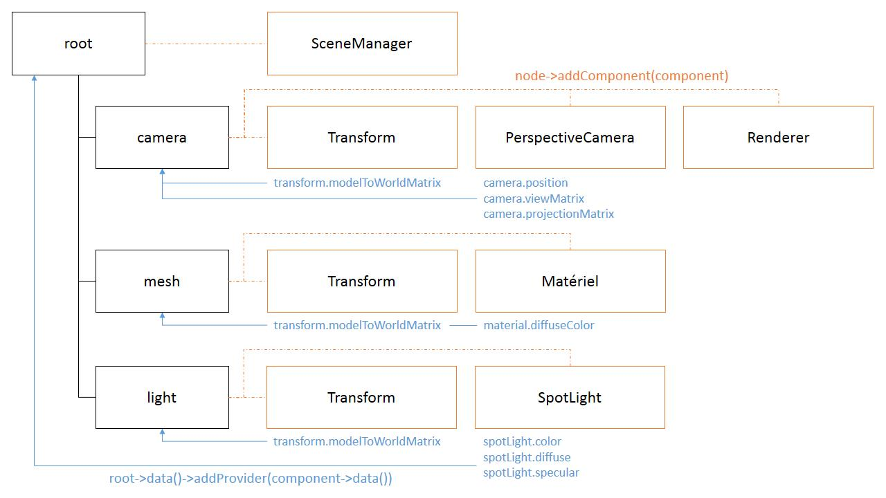

3D application are divided into two big sides: the CPU side - which is made of your application code - and the GPU side - which is made of specialized graphics programming code. When working with Minko, applications are built using C++ and the graphics hardware is programmed using GLSL. Having a specialized language for graphics programming is good because its an efficient way to create powerful and cross-platform rendering programs.

But it also yields its fair share of complexity: **how can the C++ code of our application pass values efficiently to the GLSL rendering programs?** Beside the performance consideration, what does it imply for the application developers? How can such a constraint be adressed while preserving as much flexibility as possible?

Another common issue is how to know when some properties of a scene node change in order to act accordingly. This is very important to create dynamic and interactive behaviors. For example we will likely need to create a script that will do something specific when some character of our 3D scene moves. To maximize extensibility, Minko uses a single API for the core framework, its plugins but also any 3rd party code created by libraries or application developers. **How can we watch some properties to create custom behaviors?**

To understand what could be the different issues in this process, we will start with a use case, highlight the questions it raises and then explain how Minko's data binding API answers them.

Use case
--------

To understand how our CPU side code collaborates with the GPU side program, let's take a simple example. The following code belongs to the [Create your first custom effect](../tutorial/17-Creating_a_custom_effect.md) tutorial:

asset/effect/MyCustomEffect.effect 
```javascript
{

 "name" : "MyCustomEffect",
 "attributeBindings" : {
   "aPosition" : "geometry.vertex.attribute.position"
 },
 "passes" : [{
   "vertexShader" : "
     #ifdef GL_ES
       precision mediump float;
     #endif

     attribute vec3 aPosition;

    
uniform mat4 uModelToWorldMatrix;
    
uniform mat4 uViewMatrix;
    
uniform mat4 uProjectionMatrix;

     void main(void)
     {
       gl_Position = uProjectionMatrix * uViewMatrix * uModelToWorldMatrix * vec4(aPosition, 1.0);
     }
   ",
   "fragmentShader" : "
     #ifdef GL_ES
       precision mediump float;
     #endif

     uniform vec4 uColor;

     void main(void)
     {
       gl_FragColor = uColor;
     }
   "
 }]

} 
```


src/main.cpp 
```cpp
#include "minko/Minko.hpp" 
#include "minko/MinkoSDL.hpp"

using namespace minko; 
using namespace minko::math; 
using namespace minko::component;

const uint WINDOW_WIDTH = 800; 
const uint WINDOW_HEIGHT = 600;

int main(int argc, char** argv) {

 auto canvas = Canvas::create("Hello cube!", WINDOW_WIDTH, WINDOW_HEIGHT);
 auto sceneManager = component::SceneManager::create(canvas->context());
 sceneManager->assets()->queue("effect/Basic.effect");
 auto complete = sceneManager->assets()->complete()->connect([&](file::AssetLibrary::Ptr assets)
 {
   auto myCustomEffect = assets->effect("effect/MyCustomEffect.effect");

   auto root = scene::Node::create("root")
     ->addComponent(sceneManager)
     ->addComponent(Renderer::create(0x7f7f7fff));
   auto cube = scene::Node::create("cube");
     ->addComponent(Surface::create(
       geometry::CubeGeometry(assets->context()),
       material::BasicMaterial::create()->diffuseColor(Vector4::create(0.f, 0.f, 1.f, 1.f)),
       myCustomEffect
     ));
   root->addChild(cube);

   autoModelToWorldMatrix = Matrix4x4::create()->translation(0.f, 0.f, -5.f);

   myCustomEffect->setUniform("uModelToWorldMatrix", modelToWorldMatrix);
   myCustomEffect->setUniform("uViewMatrix", Matrix4x4::create());
   myCustomEffect->setUniform("uProjectionMatrix", Matrix4x4::create()->perspective((float)WINDOW_WIDTH / (float)WINDOW_HEIGHT));

   myCustomEffect->setUniform("uColor", Vector4::create(0.f, 0.f, 1.f, 1.f));
   auto enterFrame = canvas->enterFrame()->connect([&](Canvas::Ptr canvas)
   {
     modelToWorldMatrix->prependRotationY(0.01f);
     myCustomEffect->setUniform("uModelToWorldMatrix", modelToWorldMatrix);
     
     sceneManager->nextFrame();
   });
   canvas->run();
 });
 sceneManager->assets()->load();
 return 0;

} 
```


As you can see in this example:

-   the GLSL (GPU side) program declares "uniforms";
-   the C++ code (CPU side) sets those uniforms using application values.

The problem
-----------

This code is fine and should compile/work fine. But as you might have guessed, there are multiple problems in the code that make it hardly scalable for a real life application.

The problem is the use of the `Effect::setUniform()` method. The method itself is perfectly fine. But it will affect all the objects that use this very `Effect`. To render multiple objects with different settings (position, color, etc...), we would have to follow this pseudo-code:

```
 for each object in objectToRender

 for each uniformName in object.uniformNames
   object.effect.setUniform(uniformName, object.uniformValues[uniformName]);
   render();

```


This pseudo-code raises multiple questions: # How efficient is it to set all uniforms for all objects? # How can we handle values coming from other nodes in the scene, such as lights or cameras? # What happens when we change the name of an uniform in the GLSL code? # How could we integrate third party GLSL code and plug it to the properties already available in the engine?

Another problem is to allow our application to adapt its behavior when one of the properties of a scene node changes. For example, when the 3D position of a node changes we might want to check its position relative to the mouse cursor or whether the object is actually visible at all or not. Most application scripts will actually base their behavior according to how the properties of our scene node change over time. If we store our uniforms in a simple map, we will have a hard time tracking the corresponding values and act accordingly when they change.

Another problem related to this mechanism is that some values would be updated during rendering. This can lead to broken rendering and glitches.

Thus, we need some way to know when a property changes in order to act accordingly.

The solution
------------

Minko's data binding is a simple API to:

-   store the scene node data;
-   provide signals to track how they change;
-   automate how it is pushed to the rendering pipeline.

The purpose of this API is to be used by application developers to create new scripts and behaviors based on the existing code base. It also provides everything 3rd party developers might need to extend the engine and provide new components.

### Data providers

The values themselves are store in `[data::Provider`](data::Provider`) objects. The purpose of such object is to **provide (key, value) pairs built from the name of the property - the "key" - and the corresponding value**. A `[data::Provider`](data::Provider`) is pretty much a map that can hold values with a mixed type.

Yet, they are more than just simple maps. Indeed, each `[data::Provider`](data::Provider`) provides the following signals:

-   `propertyAdded` is executed when a property is added to the provider (ie. `<data::Provider>::set()` is called with a property name that was not set before);
-   `propertyRemoved` is executed when a property is removed from the provider (ie. `<data::Provider>::unset()` is called with a property name that was previously used with `set()`);
-   `propertyChanged` is executed when the value set for a property changes.

Those three signals can be used to adapt the behavior of the application according to how the values in the provider changes.

```cpp
auto provider = <data::Provider>::create();

container->addProvider(provider);

auto propertyAdded = provider->propertyAdded()->connect([&](data::Provider::Ptr p, 
const std::string& name) {

 std::cout << "property '" << name << "' added to provider" << std::endl;

});

auto propertyChanged = provider->propertyAdded()->connect([&](data::Provider::Ptr p, 
const std::string& name) {

 std::cout << "property changed: " << name << " = " << p->get<int>(name) << std::endl;

});

auto propertyAdded = provider->propertyAdded()->connect([&](data::Provider::Ptr p, 
const std::string& name) {

 std::cout << "property '" << name << "' removed from provider" << std::endl;

});

provider->set("foo", 42); provider->set("foo", 24); provider->set("foo", 23); provider->unset(); 
```


Compiling and running this code should give the following output in the console:

```
 property 'foo' added to provider property changed: foo = 42 property changed: foo = 24 property changed: foo = 23 property 'foo' removed from provider 
```


### Data containers

A `[data::Container`](data::Container`) will store a collection of `[data::Provider`](data::Provider`) objects. Each scene `Node` as a single `[data::Container`](data::Container`) that can hold as many `[data::Provider`](data::Provider`) as necessary. The only constraint is that two different providers cannot declare the same property if they are added to the same container.

When a `[data::Provider`](data::Provider`) is added to a `[data::Container`](data::Container`), all its properties are "added" to the container. To better understand the relationship between providers and containers, please consider the following code snippet:

```cpp
auto provider = <data::Provider>::create(); auto container = <data::Container>::create();

std::cout << "provider->hasProperty(\"foo\"): " << provider->hasProperty("foo") << std::endl; std::cout << "container->hasProperty(\"foo\"): " << container->hasProperty("foo") << std::endl;

provider->set("foo", 42);

std::cout << "provider->hasProperty(\"foo\"): " << provider->hasProperty("foo") << std::endl; std::cout << "container->hasProperty(\"foo\"): " << container->hasProperty("foo") << std::endl;

container->addProvider(provider);

std::cout << "provider->hasProperty(\"foo\"): " << provider->hasProperty("foo") << std::endl; std::cout << "container->hasProperty(\"foo\"): " << container->hasProperty("foo") << std::endl; 
```


Here is the corresponding console output you should get:

```
 provider->hasProperty("foo") = false container->hasProperty("foo") = false provider->hasProperty("foo") = true container->hasProperty("foo") = false provider->hasProperty("foo") = true container->hasProperty("foo") = truee 
```


Just like data providers, `[data::Container`](data::Container`) objects provide signals to track how properties change:

-   `<data::Container>::propertyAdded()`
-   `<data::Container>::propertyRemoved()`
-   `<data::Container>::propertyChanged(propertyName)`

**When a provider is added to a container, their signals are piped** to make sure a single `[data::Container`](data::Container`) can act a the single entry point for all the `[data::Provider`](data::Provider`) objects it holds. This is true for both the properties - as explained above - and the signals. When the `<data::Provider>::propertyAdded()` signal is executed, the `<data::Container>::propertyAdded()` signal will be executed on all the containers that hold the provider that executed the signal in the first place.

```cpp
auto provider = <data::Provider>::create(); auto container = <data::Container>::create();

container->addProvider(provider);

auto propertyAddedToProvider = provider->propertyAdded()->connect([&](data::Provider::Ptr p, 
const std::string& name) {

 std::cout << "property '" << name << "' added to provider" << std::endl;

});

auto propertyAddedToContainer = container->propertyAdded()->connect([&](data::Container::Ptr c, 
const std::string& name) {

 std::cout << "property '" << name << "' added to container" << std::endl;

});

provider->set("foo", 42); 
```


Compiling and running this code should give the following output in the console:

```
 property 'foo' added to provider property 'foo' added to container 
```


### Bindings

Now that we understand how scene node properties are stored, it's time to learn how such properties can be used as the inputs of a GLSL program. To "plug" a scene node property into a GLSL input, we will declare what we call a "binding". **The purpose of each binding is to explain to the rendering pipeline what scene property shall be used as a value for a specific shader input.**

There are 4 different kinds of bindings:

-   **attribute bindings** will push data to the (vertex) attributes of a GLSL shader;
-   **uniform bindings** will push data to the uniforms of a GLSL shader;
-   **state bindings** will push data for the render states (blending, triangle culling...) of a draw call;
-   **macro bindings** will push data that will tell whether a specific GLSL macro should be defined or not and what its value should be.

**A binding is declared with at least a property name and a source.** The property name will be used to get the corresponding value from a `[data::Container`](data::Container`). The "source" will tell which container should be read. The source of a binding can be set to `<data::BindingSource>::TARGET` ("target"), `<data::BindingSource>::RENDERER` ("renderer") or `<data::BindingSource>::ROOT` ("root").

Here is an example of how uniform bindings can be declared in an `*.effect` file (to learn more about the effect files format, please read the [Effect files format reference](../article/Effect_file_format_reference.md):

```javascript
"uniformBindings" : {

 "diffuseColor"   : { "property" : "material.diffuseColor", "source" : "target" },
 "cameraPosition" : { "property" : "camera.position",       "source" : "renderer" },
 "spotLights"     : { "property" : "spotLights",            "source" : "root" }

} 
```


-   The "target" binding source indicates that the property should be read from the data container of the node that is the actual object being rendered (the node where the `Surface` component in most cases). This source is used for local properties such as the object material or its geometry.
-   The "renderer" binding source indicates that the property should be read from the data container of the node where the `Renderer` component is. This source is used for properties that depend on the renderer such as the camera.
-   The "root" binding source indicates that the property should be read from the data container of the root node of the scene. This source is used for properties that are global to the whole scene such as lights.

To better understand what "target", "renderer" and "root" might mean in this context, let's take a simple scene with a camera, a mesh and a light:

```cpp
auto root = scene::Node::create()

 ->addComponent(component::SceneManager::create(context));

auto camera = scene::Node::create()

 ->addComponent(component::PerspectiveCamera::create((float)PI / 4.f, (float)WIDTH / (float)HEIGHT))
 ->addComponent(component::Transform());

root->addChild(camera);

auto mesh = scene::Node::create()

 ->addComponent(component::Surface::create(
   geometry::CubeGeometry::create(context),
   material::Material::create()->set("diffuseColor", Vector4::create(1.f, 0.f, 1.f, 1.f)),
   basicEffect
 ))
 ->addComponent(component::Transform(
   Matrix4x4::create()->appendTranslation(0.f, 0.f, -5.f)
 ));

root->addChild(mesh);

auto light = scene::Node::create()

 ->addComponent(component::SpotLight::create())
 ->addComponent(component::Transform::create());

root->addChild(light); 
```


Here is the diagram of a simple 3D scene and its attached components:



On the diagram, you can see that:

-   the "material.diffuseColor" property is declared by the very node that will be rendererd on the screen; it's also the very node that gets affected by the actual effect therefore its binding source must be "target";
-   the "camera.position" property is declared by the scene node where the `Renderer` is, therefore its binding source must be "renderer";
-   the `SpotLight` component will add its data to the root node, therefore its binding source must be "root".

Where to go from there
----------------------

To learn more about how to work with uniform bindings, please read the [Binding the model to world transform](../tutorial/19-Binding_the_model_to_world_transform.md) or the [Binding the camera](../tutorial/20-Binding_the_camera.md) tutorial.

To learn more about how to work with macro bindings, please read the [Authoring über-shaders](../tutorial/21-Authoring_uber-shaders.md) tutorial.

