This tutorial will introduce normal mapping and how to use it in your scene.

What is a normal map
--------------------

Normal maps are images that store normal information directly in the RGB value of a pixel. It allows Minko to compute per pixel normal instead of per triangle normal inside the fragment shader. The first noticeable effect is it adds details on your 3D object that will look like there is much more triangles than reality.

If you would like more information about normal mapping and normal map: <http://en.wikipedia.org/wiki/Normal_mapping>.

Prerequisites
-------------

To fully understand the rest of the tutorial, you need to know how to setup a scene with a phong material, and how to load textures:

-   [Working with the PhongMaterial](../tutorial/11-Working_with_the_PhongMaterial.md)
-   [Loading and using textures](../tutorial/15-Loading_and_using_textures.md)

Step 0: Setup a scene
---------------------

The setup will be the same that the one at the end of the [Working with the PhongMaterial](../tutorial/11-Working_with_the_PhongMaterial.md) tutorial:

```cpp
#include "minko/Minko.hpp" 
#include "minko/MinkoPNG.hpp" 
#include "minko/MinkoSDL.hpp"

using namespace minko; 
using namespace minko::component; 
using namespace minko::math;

int main(int argc, char** argv) {

   auto canvas = Canvas::create("", 800, 600);
   auto sceneManager = SceneManager::create(canvas->context());
   // add the png parser to load textures
   // add the Phong effect
   sceneManager->assets()
       ->registerParser<[file::PNGParser>](file::PNGParser>)("png")
       ->queue("texture/diffuseMap.jpg")
   ->queue("effect/Phong.effect");
   auto _ = sceneManager->assets()->complete()->connect([=](file::AssetLibrary::Ptr assets)
   {
   auto root = scene::Node::create("root")
       ->addComponent(sceneManager);
       auto phongMaterial = material::PhongMaterial::create();
       phongMaterial->diffuseMap(assets->texture("texture/diffuseMap.jpg"));
       phongMaterial->shininess(2.f);
       phongMaterial->specularColor(math::Vector4::create(0.4f, 0.8f, 1.f, 1.f));
   auto mesh = scene::Node::create("mesh")
       ->addComponent(Transform::create(Matrix4x4::create()->prependScale(1.1)))
       ->addComponent(Surface::create(
           geometry::SphereGeometry::create(sceneManager->assets()->context()),
           phongMaterial,
           assets->effect("effect/Phong.effect")
       ));
   auto camera = scene::Node::create("camera")
           ->addComponent(Renderer::create(0x00000000))
       ->addComponent(Transform::create(Matrix4x4::create()->lookAt(Vector3::create(), Vector3::create(0.0f, 1.f, 1.3f))
           ))
       ->addComponent(PerspectiveCamera::create(800.f / 600.f, (float)PI * 0.25f, .1f, 1000.f));
   auto ambientLight = scene::Node::create("ambientLight")
       ->addComponent(AmbientLight::create(0.25f));
   ambientLight->component<AmbientLight>()->color(Vector4::create(1.0f, 1.0f, 1.0f, 1.0f));
   root->addChild(ambientLight);

   auto spotLight = scene::Node::create("SpotLight")
       ->addComponent(SpotLight::create(0.6f, 0.78f, 20.f))
       ->addComponent(Transform::create(Matrix4x4::create()->lookAt(Vector3::zero(), Vector3::create(4.f, 6.f, 2.5f))));
   spotLight->component<SpotLight>()->diffuse(0.4f);

   root->addChild(camera);
       root->addChild(mesh);
   root->addChild(spotLight);
   auto enterFrame = canvas->enterFrame()->connect([&](Canvas::Ptr canvas, float t, float dt)
   {
       sceneManager->nextFrame(t, dt);
   });
   canvas->run();
   });
   sceneManager->assets()->load();
   return 0;

} 
```


Step 1: Setting a normal map
----------------------------

`normalMap` are images just like `diffuseMap`, so their loading workflow are identical

```cpp
sceneManager->assets()->queue("texture/normalmap.jpg"); 
```


Then, the normal texture will be available in the `[file::AssetsLibrary`](file::AssetsLibrary`) once all files are loaded.

The `PhongMaterial` defines one method to set a `normalMap`:

-   `PhongMaterial::normalMap(AbstractTexture::Ptr texture)`

There is two types of texture : `Texture2D` and `CubeTexture` (listed in the `TextureType` enum). Currently only 2D textures `normalMap` are supported.

| DiffuseMap / NormalMap | Right                                                                        | Left                                                                         | Front                                                                        |
|----------------|------------------------------------------------------------------------------|------------------------------------------------------------------------------|------------------------------------------------------------------------------|
| 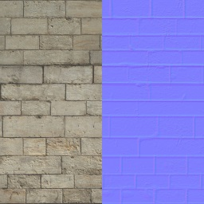  | 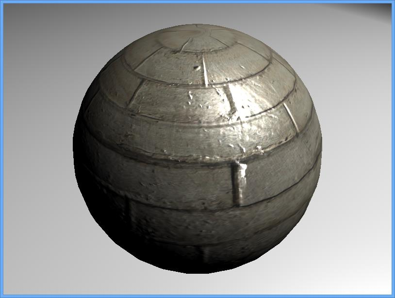     |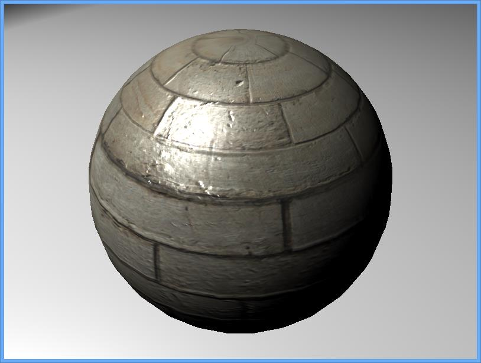    | 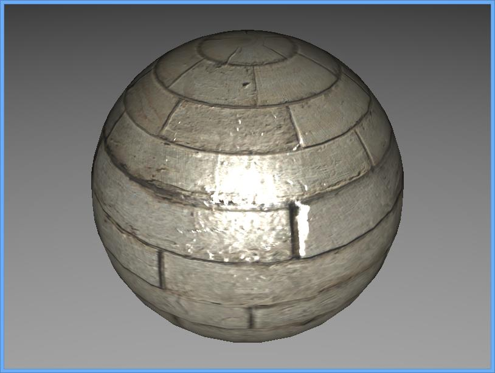   |

| DiffuseMap / NormalMap | Right                                                                        | Left                                                                         | Front                                                                        |
|----------------|------------------------------------------------------------------------------|------------------------------------------------------------------------------|------------------------------------------------------------------------------|
| 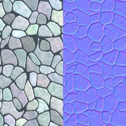 | 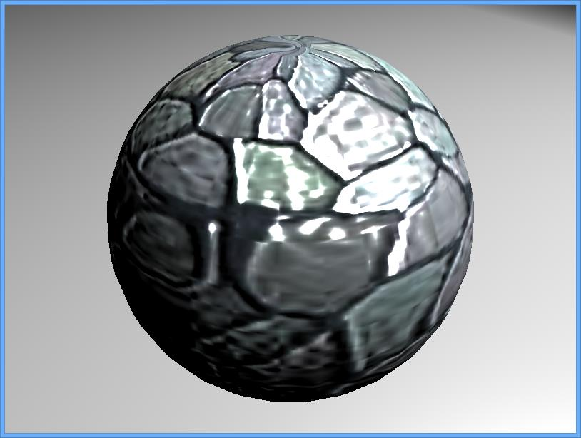 | 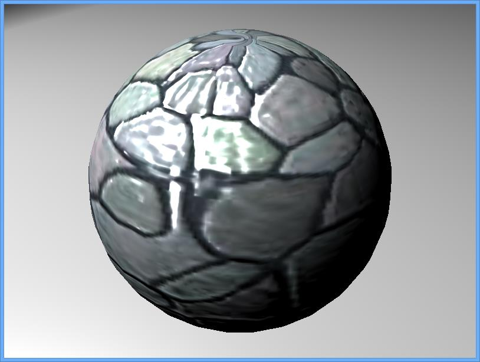 | 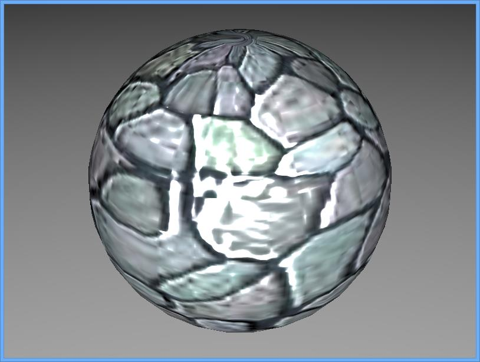  |

| DiffuseMap / NormalMap | Right                                                                        | Left                                                                         | Front                                                                        |
|----------------|------------------------------------------------------------------------------|------------------------------------------------------------------------------|------------------------------------------------------------------------------|
|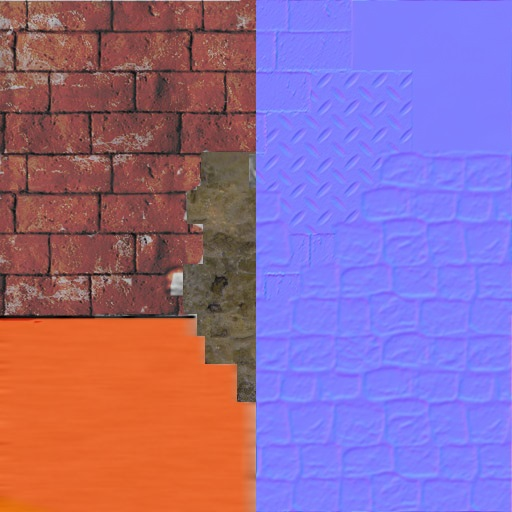 |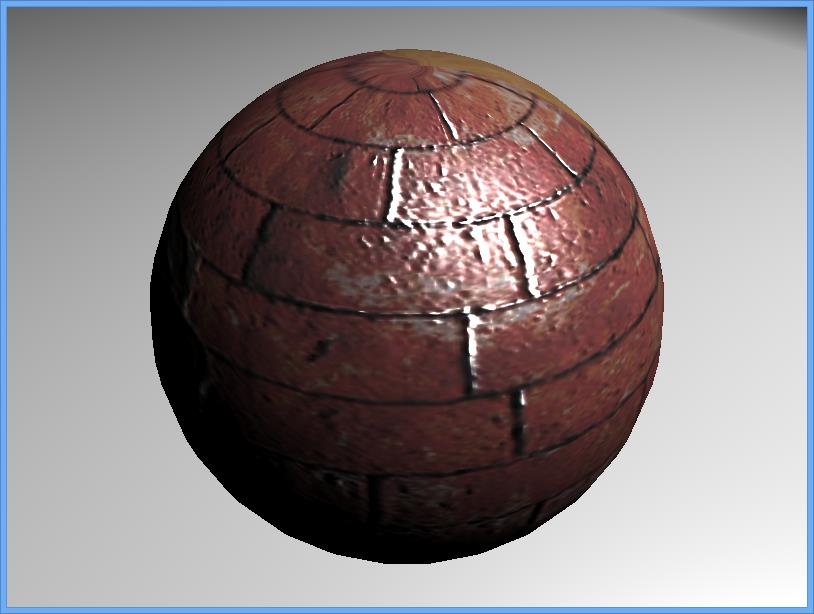 | 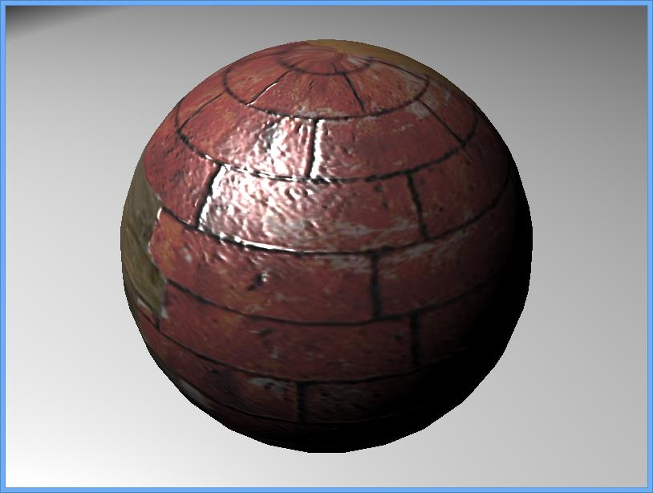 | 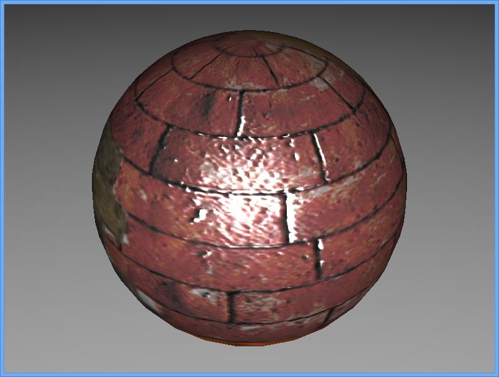  |

Final Code
----------

```cpp
#include "minko/Minko.hpp" 
#include "minko/MinkoPNG.hpp" 
#include "minko/MinkoSDL.hpp"

using namespace minko; 
using namespace minko::component; 
using namespace minko::math;

int main(int argc, char** argv) {

   auto canvas = Canvas::create("Minko Tutorial - Working with normal maps", 800, 600);
   auto sceneManager = SceneManager::create(canvas->context());
   // add the png parser to load textures
   // add the Phong effect
   sceneManager->assets()
       ->registerParser<[file::PNGParser>](file::PNGParser>)("png")
       ->queue("texture/diffuseMap.jpg")
       ->queue("texture/normalMap.jpg")
   ->queue("effect/Phong.effect");
   auto _ = sceneManager->assets()->complete()->connect([=](file::AssetLibrary::Ptr assets)
   {
   auto root = scene::Node::create("root")
       ->addComponent(sceneManager);
       auto phongMaterial = material::PhongMaterial::create();
       phongMaterial->diffuseColor(0xFFFFFFFF);
       phongMaterial->diffuseMap(assets->texture("texture/diffuseMap.jpg"));
       phongMaterial->normalMap(assets->texture("texture/normalMap.jpg"));
   auto mesh = scene::Node::create("mesh")
       ->addComponent(Transform::create(Matrix4x4::create()->prependScale(1.1)))
       ->addComponent(Surface::create(
           geometry::SphereGeometry::create(sceneManager->assets()->context()),
           phongMaterial,
           assets->effect("effect/Phong.effect")
       ));
   auto camera = scene::Node::create("camera")
           ->addComponent(Renderer::create(0x00000000))
       ->addComponent(Transform::create(Matrix4x4::create()->lookAt(Vector3::create(), Vector3::create(0.0f, 1.f, 1.3f))
           ))
       ->addComponent(PerspectiveCamera::create(800.f / 600.f, (float)PI * 0.25f, .1f, 1000.f));
   auto ambientLight = scene::Node::create("ambientLight")
       ->addComponent(AmbientLight::create(0.25f));
   ambientLight->component<AmbientLight>()->color(Vector4::create(1.0f, 1.0f, 1.0f, 1.0f));
   root->addChild(ambientLight);

   auto spotLight = scene::Node::create("SpotLight")
       ->addComponent(SpotLight::create(0.6f, 0.78f, 20.f))
       ->addComponent(Transform::create(Matrix4x4::create()->lookAt(Vector3::zero(), Vector3::create(4.f, 6.f, 2.5f))));
   spotLight->component<SpotLight>()->diffuse(0.4f);
   root->addChild(camera);
       root->addChild(mesh);
   root->addChild(spotLight);
   auto enterFrame = canvas->enterFrame()->connect([&](Canvas::Ptr canvas, float t, float dt)
   {
       sceneManager->nextFrame(t, dt);
   });
   canvas->run();
   });
   sceneManager->assets()->load();
   return 0;

} 
```


Where to go from here
---------------------

`normalMap` can me mixed with `specularMap` ([Working with specular maps](../tutorial/14-Working_with_specular_maps.md)) and/or `environmentMap` ([Working with environment maps ](../tutorial/13-Working_with_environment_maps.md)) to produce great effect on your 3D models: [ PhongMaterial reference full example](../article/PhongMaterial_reference.md#full-example).

