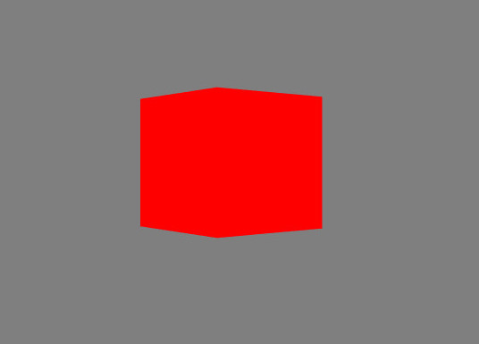
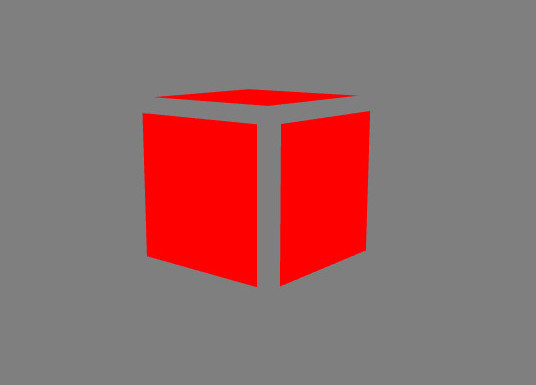
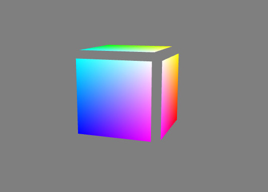

As you should have learned in the tutorials dedicated to the binding of your objects' [model-to-world transforms](../tutorial/19-Binding_the_model_to_world_transform.md) and your [camera](../tutorial/20-Binding_the_camera.md), you can easily pass uniform properties to the GPU by editing effect files. In this tutorial, we will dwell on a slightly different, albeit crucial sort of data you can hand over to your graphics card.

Principle
---------

The aforementioned tutorials illustrate the binding of `uniforms`, which are values that remain constant during the rendering of a drawcall (properties relative to your viewing or lighting conditions typically). Here, we will show you that Minko's convenient *binding* paradigm is also applicable to vertex `attributes` which, as their name implies, correspond to properties assigned to the vertices of the 3D geometry you render during your drawcall.

The granularity between uniform and attribute inputs is thus remarkably different: while the former remain constant over the entirety of your geometry, the latter vary along with it (for each of its vertices).

Typical attributes include (very surprisingly) 3D positions, but also vertex normals and texture coordinates. Those are already bound in most effects provided alongside the Minko SDK, so you will not have to worry about them too much in most cases. But shaders with such limited vertex-based inputs would be no fun, so we will show you how to hand over your own vertex attributes to your GLSL shaders here.

Where to start
--------------

This tutorial expects you already read how to bind uniforms and will start form the code you must have obtained at the end of the [binding of the camera properties](../tutorial/20-Binding_the_camera.md). You are strongly invited to at least grab the code you will find there and then proceed to the following sections.



Step 1: Add your attributes to your geometry in Minko
-----------------------------------------------------

Let us assume you want to add a 3D displacement vector to each vertex of your mesh's geometry. Clearly, you cannot resort to uniforms and shall use a vertex attribute instead. The first step to follow is thus to encapsulate this additional data into your `geometry::Geometry` and hand it over to the GPU as before. You can perfectly entirely redefine your own custom geometry, but since we will stick with the cube (and hence the `geometry::CubeGeometry`) the easiest way to go is to add another *vertex buffer* to it via the `geometry::Geometry::addVertexBuffer(render::VertexBuffer::Ptr)` method.

A `render::VertexBuffer` instance can simply be considered as a convenient wrapper around your vertex-based data (represented by a `std::vector<float>`) that only stores the information necessary for the rendering context to process your data. Besides the data itself, a vertex buffer also specifies:

-   the *property name* bound to the attribute (here, `positionOffset`),
-   the *size* of each attribute in terms of floats (here, 3 as each corresponds to a `vec3` GLSL type),
-   the *offset* inside the `std::vector<float>` of the attribute in terms of floats (here, 0 as the attribute is alone within the vertex buffer).

In the following code, we exploit the simplicity of the cube geometry (six separate vertices for the six faces of the cube) in order to create a vertex buffer, the data of which is used to slightly move the vertex positions along the face normals (the actual vertex displacement is done in the vertex shader program as shown below).

```cpp
geometry::Geometry::Ptr createGeometryWithAttribute(render::AbstractContext::Ptr context) {

 auto cubeGeometry = geometry::CubeGeometry::create(context); // original cube geometry

 auto numVertices  = cubeGeometry->numVertices(); // 36 vertices (6 vertices per face)
 auto offsetData   = std::vector<float>(3 * numVertices, 0.0f); // vec3 per vertex

 uint i = 0;
 for (uint vertexId = 0; vertexId < numVertices; ++vertexId)
 {
   float dx = 0.0f; // components of the normal displacement
   float dy = 0.0f;
   float dz = 0.0f;
   
   switch (vertexId / 6) // faceId
   {
   case 0:
     dy += 0.1f;
     break;
   case 1:
     dy -= 0.1f;
     break;
   case 2:
     dz -= 0.1f;
     break;
   case 3:
     dz += 0.1f;
     break;
   case 4:
     dx -= 0.1f;
     break;
   case 5:
     dx += 0.1f;
     break;
   }
   
   offsetData[i++] = dx;
   offsetData[i++] = dy;
   offsetData[i++] = dz;
 }

 auto offsetBuffer = render::VertexBuffer::create(context, offsetData);
 offsetBuffer->addAttribute("positionOffset", 3, 0);

 cubeGeometry->addVertexBuffer(offsetBuffer);

 return cubeGeometry;

} 
```


This vertex buffer is added to the geometry and finally, in the `main` procedure, we simply hand over this newly augmented geometry to the existing `component::Surface` in order to visualize the changes caused by our new vertex shader and its custom attribute inputs.

```cpp
int main(int argc, char** argv) {

 ...
 auto complete = sceneManager->assets()->complete()->connect([&](file::AssetLibrary::Ptr assets)
 {
   ... 
   auto cube = scene::Node::create("cube")
     ->addComponent(Transform::create(
       Matrix4x4::create()->translation(0.f, 0.0f, -5.f)
     ))
     ->addComponent(Surface::create(
       createGeometryWithAttribute(assets->context()), // geometry with add. vertex attribute
       myCustomMaterial,
       myCustomEffect
     ));
   ...
 });
 sceneManager->assets()->load();
 return 0;

} 
```


What we did here is simply enhance the former cube geometry with an additional `positionOffset` vertex attribute. However, the vertex attribute values are yet to be sent over to the GPU and your GLSL code. We will see how to proceed in an instant.

Step 2: Add your binding in your effect file
--------------------------------------------

Pretty similarly to what we did for the uniform inputs for our effect (in order to specify the [model's transform](../tutorial/19-Binding_the_model_to_world_transform.md) and [viewing settings of our scene](../tutorial/20-Binding_the_camera.md)), we just have to *bind* the data stored in our Minko geometry to some actual `attribute` on the GLSL side. The per-vertex values taken by our `positionOffset` attribute are currently stored in the data provider of our geometry, and we will actually use them via a GLSL attribute input we will call `aPositionOffset`.

The vertex attribute binding between the geometry's data provider and our GLSL attribute is straightforwardly done by simply adding a single line in the effect file's `attributeBindings` dictionary, where the key corresponds to the name of the GLSL attribute and the value to the matching property name manipulated by the Minko engine's data providers.

```javascript
{

 "name" : "MyCustomEffect",
 "attributeBindings" : {
   ...
   "aPositionOffset" : "geometry[${geometryId}].positionOffset"
 },
 ...

} 
```


From now on, we can actually use the values we stored in the geometry on the CPU side, within the code of our shaders executed on the GPU.

Step 3: Use your vertex attributes in GLSL
------------------------------------------

Because a meaningful vertex attribute is only one that is actually used in computations of the shader program, we now update the source code of our custom effect's vertex shader in order to use our additional `aOffsetPosition` attribute and move the position of our vertices in local space according to its values.

```javascript
{

 "name" : "MyCustomEffect",
 ...
 "passes" : [{
   "vertexShader" : "
     #ifdef GL_ES
     precision mediump float;
     #endif
     attribute vec3 aPosition;
     attribute vec3 aPositionOffset;
    
uniform mat4 uModelToWorldMatrix;
    
uniform mat4 uWorldToScreenMatrix;
     void main(void)
     {
       gl_Position = uWorldToScreenMatrix * uModelToWorldMatrix * vec4(aPosition + aPositionOffset, 1.0);
     }
   ",
   "fragmentShader" : "
      ...
   "
 }]

} 
```


If everything went smooth, you should obtain something like this (the vantage point has been slightly altered for better readability):



Step 1/2: Add your attributes to your effect in Minko (for the lazy and the reckless)
-------------------------------------------------------------------------------------

While it is currently strongly advised to embed your vertex attribute into an instance of `geometry::Geometry`, it is still possible to bypass this mechanism and directly specify vertex attributes via an `render::Effect`. It is done by calling the `render::Effect::setVertexAttribute()` method. This approach has the marginal advantage to spare you extra code, but on the other hand forces you to precisely know the unfolding of the geometry the rendered `component::Surface` has been created with (namely how its index buffer access its associated vertex data).

Here, we will ditch our old `uColor` uniform variable and replace it with per vertex color sent to the GPU as the `aVertexColor` attribute. It will be output as the final fragment's color after hardware bilinear interpolation (via the `vVertexColor` varying fragment shader input).

But this time, we will not bind our new `aVertexColor` vertex attribute via the `attributeBindings` section of the effect file. Instead, we will directly pass over our vertex color data (stored in the `colorData` container in the following) to our custom effect instance.

```
 render::Effect::Ptr getEffectWithAttribute(file::AssetLibrary::Ptr assets) {

   
const uint  numVertices = 36;
   auto        colorData   = std::vector<float>(4 * numVertices, 0.0f); // vec4 per vertex
   
   ... // initialize the 'colorData' float array

   auto myCustomEffect = assets->effect("effect/MyCustomEffect.effect");

   myCustomEffect->setVertexAttribute("aVertexColor", 4, colorData);

   return myCustomEffect;

}

int main(int argc, char** argv) {

 ...
 auto complete = sceneManager->assets()->complete()->connect([&](file::AssetLibrary::Ptr assets)
 {
   ...
   auto cube = scene::Node::create("cube")
     ->addComponent(Transform::create(
       Matrix4x4::create()->translation(0.f, 0.0f, -5.f)
     ))
     ->addComponent(Surface::create(
       createGeometryWithAttribute(assets->context()), // geometry with add. vertex attribute
       myCustomMaterial,
       getEffectWithAttribute(assets)
     ));
   ...
 });
 sceneManager->assets()->load();
 return 0;

} 
```


As highlighted in the complete code listed below, the pitfall here is to carefully initialize the vertex attribute data in such a way that the manually specified attribute values match vertices in a relevant manner.

Follows the code of the updated GLSL vertex and fragment shaders stoed in the custom effect file.

```javascript
{

 "name" : "MyCustomEffect",
 ...
 "passes" : [{
   "vertexShader" : "
     ...
     attribute vec4 aVertexColor;

     varying vec4 vVertexColor;

     ...
     void main(void)
     {
       vVertexColor = aVertexColor;
       ...
     }
   ",
   "fragmentShader" : "
     ...
     varying vec4 vVertexColor; // interpolated across triangular face

     void main(void)
     {
       gl_FragColor = vVertexColor;
     }
   "
 }]

} 
```




Final code
----------

asset/effect/MyCustomEffect.effect

```javascript
{

 "name" : "MyCustomEffect",
 "attributeBindings" : {
   "aPosition" : "geometry[${geometryId}].position",
   "aPositionOffset" : "geometry[${geometryId}].positionOffset"
 },
 "uniformBindings" : {
   "uModelToWorldMatrix" : "transform.modelToWorldMatrix",
   "uWorldToScreenMatrix" : { "property" : "camera.worldToScreenMatrix", "source" : "renderer" }
 },
 "passes" : [{
   "vertexShader" : "
     #ifdef GL_ES
     precision mediump float;
     #endif
     attribute vec3 aPosition;
     attribute vec3 aPositionOffset;
     attribute vec4 aVertexColor;

     varying vec4 vVertexColor;

    
uniform mat4 uModelToWorldMatrix;
    
uniform mat4 uWorldToScreenMatrix;

     void main(void)
     {
       vVertexColor = aVertexColor;

       gl_Position = uWorldToScreenMatrix * uModelToWorldMatrix * vec4(aPosition + aPositionOffset, 1.0);
     }
   ",
   "fragmentShader" : "
     #ifdef GL_ES
     precision mediump float;
     #endif
 
     varying vec4 vVertexColor; // interpolated across triangular face

     void main(void)
     {
       gl_FragColor = vVertexColor;
     }
   "
 }]

} 
```


src/main.cpp

```cpp
#include "minko/Minko.hpp" 
#include "minko/MinkoSDL.hpp"

#include "MyCustomMaterial.hpp"

using namespace minko; 
using namespace minko::math; 
using namespace minko::component;

const uint WINDOW_WIDTH = 800; 
const uint WINDOW_HEIGHT = 600;

geometry::Geometry::Ptr createGeometryWithAttribute(render::AbstractContext::Ptr);

render::Effect::Ptr getEffectWithAttribute(file::AssetLibrary::Ptr);

int main(int argc, char** argv) {

 auto canvas = Canvas::create("Minko Tutorial - Working with custom vertex attributes", WINDOW_WIDTH, WINDOW_HEIGHT);
 auto sceneManager = component::SceneManager::create(canvas->context());
 sceneManager->assets()->queue("effect/MyCustomEffect.effect");
 auto complete = sceneManager->assets()->complete()->connect([&](file::AssetLibrary::Ptr assets)
 {
   auto root = scene::Node::create("root")
     ->addComponent(sceneManager);
   auto camera = scene::Node::create()
     ->addComponent(Renderer::create(0x7f7f7fff))
     ->addComponent(Transform::create(
           Matrix4x4::create()->lookAt(Vector4::create(0.0f, 0.0f, -5.0f), Vector4::create(0.0f, 1.0f, 0.0f))
       ))
     ->addComponent(PerspectiveCamera::create((float)WINDOW_WIDTH / (float)WINDOW_HEIGHT));
   root->addChild(camera);
   auto myCustomMaterial   = material::MyCustomMaterial::create();
   auto cube = scene::Node::create("cube")
     ->addComponent(Transform::create(
       Matrix4x4::create()->translation(0.f, 0.0f, -5.f)
     ))
     ->addComponent(Surface::create(
       createGeometryWithAttribute(assets->context()), // geometry with add. vertex attribute
       myCustomMaterial,
       getEffectWithAttribute(assets)
     ));
   root->addChild(cube);
   auto enterFrame = canvas->enterFrame()->connect([&](Canvas::Ptr canvas, float t, float dt)
   {
     cube->component<Transform>()->matrix()->prependRotationY(0.01f);
     sceneManager->nextFrame(t, dt);
   });
   canvas->run();
 });
 sceneManager->assets()->load();
 return 0;

}

geometry::Geometry::Ptr createGeometryWithAttribute(render::AbstractContext::Ptr context) {

   auto cubeGeometry   = geometry::CubeGeometry::create(context); // original cube geometry

   auto numVertices    = cubeGeometry->numVertices(); // 36 vertices (6 vertices per face)
   auto offsetData     = std::vector<float>(3 * numVertices, 0.0f); // vec3 per vertex

   uint i = 0;
   for (uint vertexId = 0; vertexId < numVertices; ++vertexId)
   {
       float dx = 0.0f; // components of the normal displacement
       float dy = 0.0f;
       float dz = 0.0f;
       
       switch (vertexId / 6) // faceId
       {
       case 0:
           dy += 0.1f;
           break;
       case 1:
           dy -= 0.1f;
           break;
       case 2:
           dz -= 0.1f;
           break;
       case 3:
           dz += 0.1f;
           break;
       case 4:
           dx -= 0.1f;
           break;
       case 5:
           dx += 0.1f;
           break;
       }
       
       offsetData[i++] = dx;
       offsetData[i++] = dy;
       offsetData[i++] = dz;
   }

   auto offsetBuffer = render::VertexBuffer::create(context, offsetData);
   offsetBuffer->addAttribute("positionOffset", 3, 0);

   cubeGeometry->addVertexBuffer(offsetBuffer);

   return cubeGeometry;

}

render::Effect::Ptr getEffectWithAttribute(file::AssetLibrary::Ptr assets) {

   
const uint  numVertices = 36;
   auto        colorData   = std::vector<float>(4 * numVertices, 0.0f); // vec4 per vertex
   
   uint i = 0;
   for (uint vId = 0; vId < numVertices; ++vId)
   {
       float r = 0.0f;
       float g = 0.0f;
       float b = 0.0f;
       float a = 1.0f;

       if (vId == 7 || vId == 10 || vId == 12 || vId == 16 || vId == 30 || vId == 35)
       {
           r = 1.0f;
       }
       else if (vId == 4 || vId == 13 || vId == 15 || vId == 25 || vId == 27)
       {
           g = 1.0f;
       }
       else if (vId == 6 || vId == 11 || vId == 19 || vId == 21 || vId == 24 || vId == 28)
       {
           b = 1.0f;
       }
       else if (vId == 0 || vId == 3 || vId == 14 || vId == 31)
       {
           r = 1.0f; g = 1.0f;
       }
       else if (vId == 8 || vId == 22 || vId == 34)
       {
           r = 1.0f; b = 1.0f;
       }
       else if (vId == 1 || vId == 5 || vId == 18 || vId == 29)
       {
           g = 1.0f; b = 1.0f;
       }
       else if (vId == 2 || vId == 20 || vId == 23 || vId == 32 || vId == 33)
       {
           r = 1.0f; g = 1.0f; b = 1.0f;
       }

       colorData[i++] = r;
       colorData[i++] = g;
       colorData[i++] = b;
       colorData[i++] = a;
   }

   auto myCustomEffect = assets->effect("effect/MyCustomEffect.effect");

   myCustomEffect->setVertexAttribute("aVertexColor", 4, colorData);

   return myCustomEffect;

} 
```


