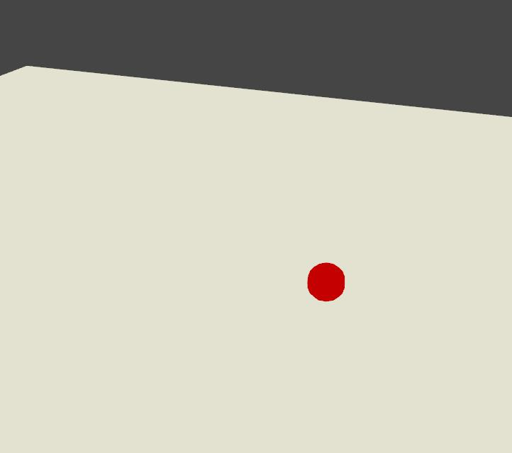
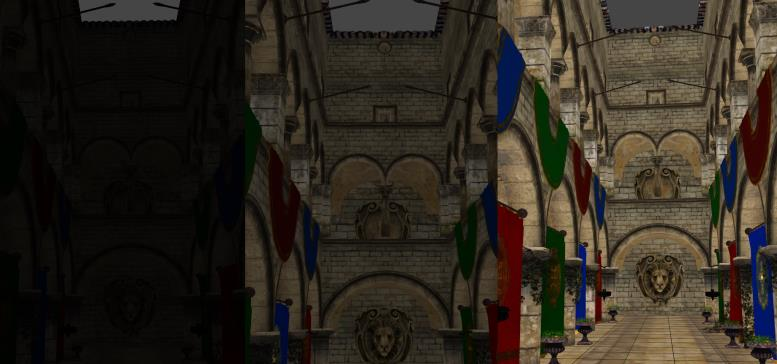

An ambient light emits soft light rays in every direction, it can be used to elevate the overall level of diffuse illumination in a scene. It's important to understand that it has no specific directionality, and therefore casts no ground shadow.



Ambient light emitting in all direction. no ground shadows are displayed

The most important setting about ambient light is its diffuse level; in the following picture you can see the same scene with three different diffuse settings.



Step 1: Instantiate an light
----------------------------

The first very first thing you need to do is to include the following header to your .cpp file.

```cpp
#include <AmbientLight.hpp> 
```


To create a new [AmbientLight](http://doc.v3.minko.io/reference/classminko_1_1component_1_1_ambient_light.html) object, we simply use the `AmbientLight::create()` static method (alternatively you can specify the value of the ambient light intensity by passing a float to the create method, for example `AmbientLight::create(0.2f)`).

Step 2: Adding the light to the scene
-------------------------------------

To add a light to the scene, you have to understand that a `Scene` is a graph composed of one or more `Node`. Those nodes can contain elements that are called `Component`.

As an `AmbientLight` is a `Component` you'll have to follow this logic to create and add a light to a scene.

```cpp


 // Creating the Node
 auto ambientLightNode = scene::Node::create("ambientLight")

 // Adding the Component AmbientLight
 ambientLightNode->addComponent(AmbientLight::create(0.5f));

// Adding the Node containing the light component to the scene graph
 root->addChild(ambientLightNode);

```


As you can see in the code above, we first create a node named "ambientLight" to which we add an instance of an ambient light, then we can add this node to the scene graph. Of course you can chain methods to perform all in one line of code

```cpp


 // Creating the Node & adding the Component AmbientLight
 auto ambientLight = scene::Node::create("ambientLight")->addComponent(AmbientLight::create(0.5f));

```


Step 3: Change ambient light properties
---------------------------------------

you can directly change way the light appears by modifying it's public parameters, for example : 
```cpp


 auto ambientLight = AmbientLight::create(0.5f);

 // Set the light diffuse color
 ambientLight->color()->setTo(0,0,0);

```


Step 4: Removing a light from the scene
---------------------------------------

You may sometime need to remove a light from a scene, to do this you simply need to remove the ambient light from the `Node` it has been added to before.

```cpp


 // Adding an ambient light
 auto ambientLightNode = scene::Node::create("ambientLight")->addComponent(AmbientLight::create(0.5f));

 // retrieving the component 
 auto ambientLight = ambientLightNode->component<AmbientLight>(0);

 // Remove the component from the node
 ambientLightNode->removeComponent(ambientLight);

```


As you can see above, the first step is to retrieve the light component with previously created and then remove it from the `Node`

Final Code
----------

```cpp
#include "minko/Minko.hpp" 
#include "minko/MinkoPNG.hpp" 
#include "minko/MinkoSDL.hpp"

using namespace minko; 
using namespace minko::math; 
using namespace minko::component;

const uint WINDOW_WIDTH = 800; 
const uint WINDOW_HEIGHT = 600;

int main(int argc, char** argv) {

   auto canvas = Canvas::create("Minko Tutorial - Working with ambient lights", WINDOW_WIDTH, WINDOW_HEIGHT);
   auto sceneManager = component::SceneManager::create(canvas->context());
   sceneManager->assets()
       ->registerParser<[file::PNGParser>](file::PNGParser>)("png")
       ->queue("effect/Phong.effect")
       ->queue("texture/box.jpg");
 
   auto complete = sceneManager->assets()->complete()->connect([&](file::AssetLibrary::Ptr assets)
   {
       auto root = scene::Node::create("root")
           ->addComponent(sceneManager);
       auto camera = scene::Node::create("camera")
           ->addComponent(Renderer::create(0x7f7f7fff))
           ->addComponent(PerspectiveCamera::create(
               (float)WINDOW_WIDTH / (float)WINDOW_HEIGHT, (float)PI * 0.25f, .1f, 1000.f
           ));
       root->addChild(camera);
       auto texturedCube = scene::Node::create("texturedCube")
           ->addComponent(Transform::create(Matrix4x4::create()->translation(0.f, 0.f, -5.f)))
           ->addComponent(Surface::create(
               geometry::CubeGeometry::create(assets->context()),
           material::Material::create()->set("diffuseMap", assets->texture("texture/box.jpg")),
               assets->effect("effect/Phong.effect")));

       texturedCube->component<Transform>()->matrix()->prependRotationY(PI * 0.25f);
       root->addChild(texturedCube);

   // adding an ambient light to the scene
       auto ambientLightNode = scene::Node::create("ambientLight")
       ->addComponent(AmbientLight::create(0.5f));
       ambientLightNode->component<AmbientLight>()->color()->setTo(1.0f, 1.0f, 1.0f);
       root->addChild(ambientLightNode);
   });

   auto enterFrame = canvas->enterFrame()->connect([&](Canvas::Ptr canvas, float t, float dt)
   {
       sceneManager->nextFrame(t, dt);
   });
   sceneManager->assets()->load();
   canvas->run();
   return 0;

} 
```


