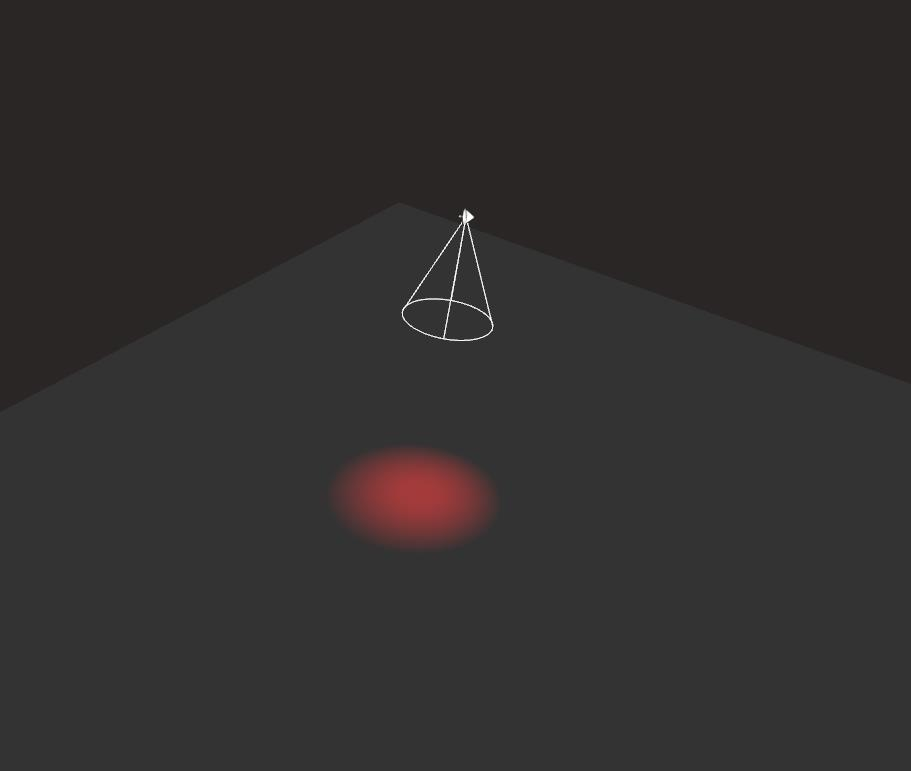
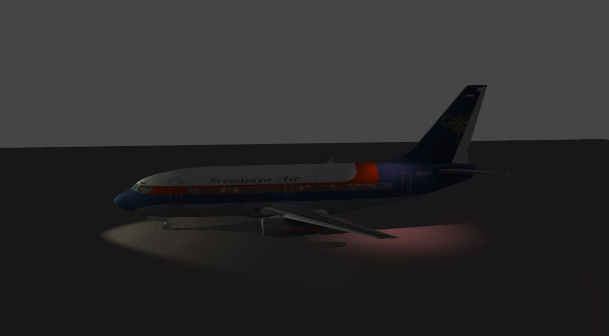

Spot lights are rather similar to their real-world counterparts. A spot light emits a cone shaped light field from a single point in space. Spotlights are often used for three-point studio lighting, and also for simulating any light fixture where there is a distinct visual falloff from light to dark—streetlights, desk lamps, overhead cone lighting, etc.

Let's start with something simple, a red spot light, emitting to the ground. as the widget imply, the light is only spread in one direction.



This setup is a little more complex, it introduces multiple spot lights emitting on a complex object with shadows enabled. As you can see with the yellowish light, the light attenuate with the distance, the closer the object is from the spot light, the stronger the light light will be.



Step 1: Instantiate a spot light
--------------------------------

The first very first thing you need to do is to include the following header to your .cpp file.

```cpp
#include <SpotLight.hpp> 
```


To create a new [SpotLight](http://doc.v3.minko.io/reference/classminko_1_1component_1_1_spot_light.html) object, we simply use the `PointLight::create` static method.

The create method needs at least two arguments to be instantiated :

-   float *innerAngleRadians*: defines the inner angle for the cone of light
-   float *outerAngleRadians*: defines the outer angle for the cone of light
-   **(optional)** float *attenuationDistance* : defines the attenuation of the light emitted proportionally to the distance

Step 2: Adding a spot light to the scene
----------------------------------------

To add a point light to a scene, you have to understand that a `Scene` is a graph composed of one or more `Node`. Those nodes can contain elements that are called `Component`.

As a `SpotLight` is a `Component` you'll have to follow this logic to create and add a light to a scene.

```cpp


 // Creating the Node
 auto spotLightNode = scene::Node::create("spotLight");
       
 // Adding the Component SpotLight
 spotLightNode->addComponent(SpotLight::create(.15f, .4f));

  // Adding the Node to the root of the scene graph
 root->addChild(spotLightNode);

```


As you can see in the code above, we first create a node named "spotLight" to which we add an instance of a spot light. Of course you can chain those methods to perform all in one line of code

```cpp


 // Creating the Node & adding the Component SpotLight
 auto spotLightNode = scene::Node::create("spotLight")->addComponent(SpotLight::create(.15f, .4f));

```


Step 3: Change spot light properties
------------------------------------

you can directly change way the light appears by modifying it's public parameters, for example : 
```cpp


 auto spotLight = SpotLight::create(.15f, .4f);
 spotLight->diffuse(.4f);

```


Step 4: Adjust a spot light
---------------------------

Once the light is created you might want to turn the spot light toward a direction. To do this you need to add a transformation matrix to the Node holding your spot light.

```cpp
auto spotLight = scene::Node::create("spotLight")

       ->addComponent(SpotLight::create(.15f, .4f))
       ->addComponent(Transform::create(Matrix4x4::create()->lookAt(Vector3::zero(), Vector3::create(15.f, 20.f, 0.f))));

```


Step 5: Remove a spot light from the scene
------------------------------------------

You may sometime need to remove a light from a scene, to do this you simply need to remove the spot light from the `Node` it has been added to before.

```cpp


 // Adding an spot light
 auto spotLightNode = scene::Node::create("spotLight")->addComponent(SpotLight::create(.15f, .4f));

 // retrieving the component 
 auto spotLight = spotLightNode->component<SpotLight>(0);

 // Remove the component from the node
 spotLightNode->removeComponent(spotLight);

```


As you can see above, the first step is to retrieve the light component with previously created and then remove it from the `Node`

Final code
----------

```cpp
#include "minko/Minko.hpp" 
#include "minko/MinkoSDL.hpp"

using namespace minko; 
using namespace minko::math; 
using namespace minko::component;

const uint WINDOW_WIDTH = 800; 
const uint WINDOW_HEIGHT = 600;

int main(int argc, char** argv) {

   auto canvas = Canvas::create("Minko Tutorial - Working with spot lights", WINDOW_WIDTH, WINDOW_HEIGHT);
   auto sceneManager = component::SceneManager::create(canvas->context());

   // setup assets
   sceneManager->assets()->defaultOptions()->generateMipmaps(true);
   sceneManager->assets()->queue("effect/Phong.effect");

   auto complete = sceneManager->assets()->complete()->connect([&](file::AssetLibrary::Ptr assets)
   {
       auto root = scene::Node::create("root")->addComponent(sceneManager);

       auto camera = scene::Node::create("camera")
           ->addComponent(Renderer::create(0x7f7f7fff))
           ->addComponent(Transform::create(
           Matrix4x4::create()->lookAt(Vector3::zero(), Vector3::create(0.f, 3.f, -5.f))
           ))
           ->addComponent(PerspectiveCamera::create(
           (float) WINDOW_WIDTH / (float) WINDOW_HEIGHT, (float) PI * 0.25f, .1f, 1000.f)
           );
       root->addChild(camera);

       // create a ground
       auto ground = scene::Node::create("sphere")
           ->addComponent(Surface::create(
           geometry::QuadGeometry::create(assets->context()),
           material::BasicMaterial::create()->diffuseColor(Vector4::create(0.f, 0.f, 0.f, 1.f)),
           assets->effect("effect/Phong.effect")
           ))
           ->addComponent(Transform::create(Matrix4x4::create()->appendScale(3.f)->appendRotationX(-1.57f)));
       root->addChild(ground);

       // create the spot light node
       auto spotLightNode = scene::Node::create("spotLight");

       // change the spot light position
       spotLightNode->addComponent(Transform::create(Matrix4x4::create()->lookAt(Vector3::zero(), Vector3::create(0.1f, 2.f, 0.f))));

       // create the point light component
       auto spotLight = SpotLight::create(.15f, .4f);

       // update the spot light component attributes
       spotLight->diffuse(0.5f);

       // add the component to the spot light node
       spotLightNode->addComponent(spotLight);

       // add the node to the root of the scene graph
       root->addChild(spotLightNode);

       auto enterFrame = canvas->enterFrame()->connect([&](Canvas::Ptr canvas, float t, float dt)
       {
           spotLightNode->component<Transform>()->matrix()->appendRotationX(0.002f * dt);

           sceneManager->nextFrame(t, dt);
       });

       canvas->run();
   });

   sceneManager->assets()->load();

   return 0;

} 
```


