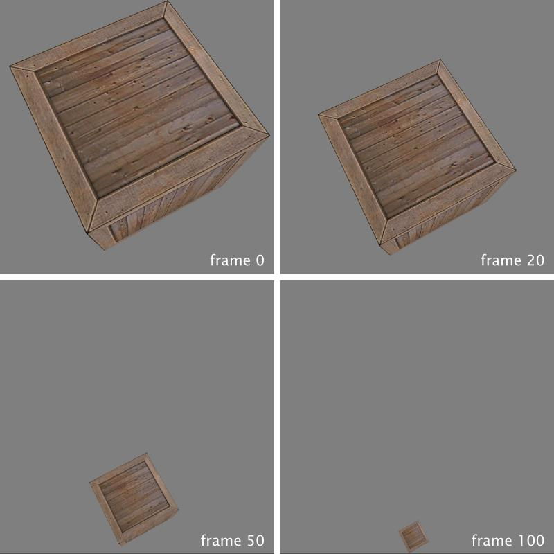
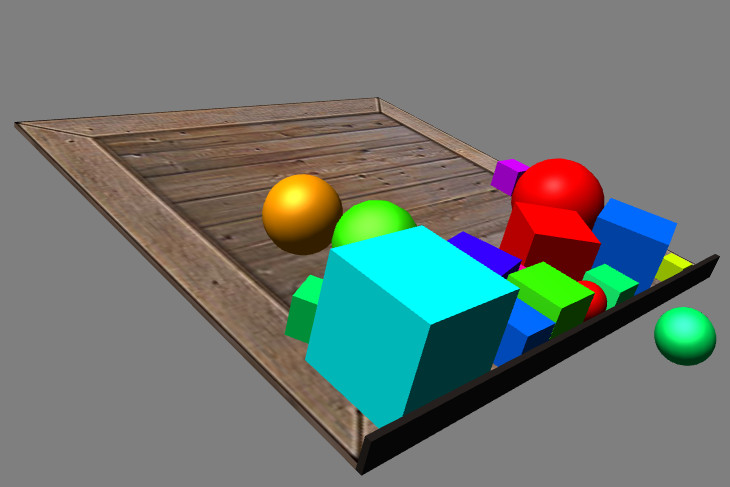

In this day and age, compelling real-time physics simulation is just a first step towards an enhanced gameplay experience and basic realism in games.

For that aim, Minko empowers its users with the accuracy and power of the Bullet physics library and seamlessly embeds this powerhouse within its framework.

The goal of this tutorial is to help you skim your way through both Minko and Bullet source codes, and instead run a basic physics simulation with Minko C++ API in no time. And speaking of 'basic', how about having our good ol' cube succumbing to the irresistible power of gravity and thus... fall? Sounds exciting, let's get started!

Principle
---------

**Note** Before diving into the subject, we expect you already have some basic knowledge of the core concepts behing Minko and that notions such as nodes and components are familiar to you. If not, I am afraid the falling cube will have to wait a bit and you are invited to refer to previous tutorials.

Every object in a Minko scene is a node, the purpose of which is then defined by attaching components to it. Physics is naturally no exception to paradigm. Any object taking part in the final physics simulation must be attached a special flavor of components called *colliders*, and the englobing scene node be attached another component that considers all these colliders and computes their interractions.

Step 0: Invoke the 'bullet' Minko plugin
----------------------------------------

But first things first, you must before anything else [enable the 'bullet' plugin](../tutorial/How_to_enable_a_plugin.md) and then include the 'bullet' plugin's main header file into your project source code:

```cpp
#include "minko/MinkoBullet.hpp" 
```


Step 1: Set up your physics world
---------------------------------

Parallel to your rendered, visible world should exist a *physics world* where all the computations governed by the laws of physics take place. Both universes then synchronize one another at each frame in order to physically animate the visible objects of your scene.

For your simulation to work, you thus need to add a `minko::component::bullet::PhysicsWorld` to the scene node "you want the simulation to take place in", or alternatively, the node only the children of which will actually participate to the simulation. In most cases, this node will simply be the root of the scene node hierarchy.

**Note** Please remember that for the simulation to be updated at the end of each frame, the addition of a `minko::component::Renderer` somewhere in your scene node hierarchy is mandatory.

```cpp
auto root = scene::Node::create("root")

   ->addComponent(sceneManager)
   ->addComponent(bullet::PhysicsWorld::create());

```


From now on, you have a physics world that takes care of all physics-based computations for your scene at your disposal. Let's populate this desolated world, shall we ?

Step 2: Make your scene nodes physics-aware
-------------------------------------------

Indeed, simply adding nodes to your rendered scene is not enough, you must introduce your objects to the physics world you just created. And in order to add objects to your scene's physics world, you must attach a `minko::component::bullet::Collider` component to the scene nodes that will be part of your simulation. Such nodes will then have their *position* and *orientation* governed by the law of physics and move around accordingly.

Colliders are initialized with instances of `minko::component::bullet::ColliderData` which are nothing more than storage structures gathering most of the relevant physical properties you would want to adorn your objects. At the time of the writting of this article, only rigid objects are supported in Minko.

Of paramount importance are the following properties of a collider data instance :

-   its *mass*: if equal to zero, then the object is considered as static (and will repel moving objects without having its own position or orientation altered)
-   its *shape*: it will represent how the physics simulation "sees" your object, and while it should remain faithful to its rendered counterpart, it should also be simple enough to ensure fast computation (only tailored spherical, cubic, and cylindrical shapes are available).

Follows the example of a simple falling cube, the corresponding node of which is added a box-shaped collider weighting 5 kg:

```cpp
auto boxColliderData = bullet::ColliderData::create(

   5.0f, // strictly positive mass
   bullet::BoxShape::create(0.5f, 0.5f, 0.5f) // shape strictly matches the CubeGeometry

); auto boxNode = scene::Node::create("boxNode")

   ->addComponent(bullet::Collider::create(boxColliderData))
   ->addComponent(Surface::create(
       geometry::CubeGeometry::create(assets->context()),
       material::BasicMaterial::create()->diffuseMap(assets->texture(TEXTURE_FILENAME)),
       assets->effect("effect/Basic.effect")
   ));

```


Step 3: Run your simulation
---------------------------

Simply adding your collider-bearing node to the scene:

```cpp
root->addChild(boxNode); 
```


is now enough to trigger the simulation, and watch our poor cube fall under the effect of gravity.



**Important** When adding a new child node to your scene, a `minko::component::bullet::PhysicsWorld` must already be present in the set of its newly-defined parent nodes. If not, this added node will simply be ignored from the simulation regardless of the validity of its attached collider.

Also note that even though `boxNode` has not been explicitly added a `minko::component::Transform` component, our cube indeed moves around and has its position and orientation updated by the simulation anyway: it is so because a `minko::component::Transform` has been automatically added to the node when it entered the physics world. Our cube thus starts the simulation lying at the origin of the world without any orientation. Needless to say it is always preferred, if not more convenient, to have you add this `minko::component::Transform` yourself.

**Note** You will most likely want your physics objects to be *visible* objects, or more formally `minko::component::Surface`-bearing nodes (as illustrated in this tutorial). However, nothing prevents you from attaching colliders to any node, may it be invisible, such as a camera-dedicated node for instance.

Final code
----------

```cpp
#include "minko/Minko.hpp" 
#include "minko/MinkoPNG.hpp" 
#include "minko/MinkoSDL.hpp" // STEP 0 
#include "minko/MinkoBullet.hpp"

using namespace minko; 
using namespace minko::scene; 
using namespace minko::component; 
using namespace minko::math;

const uint WINDOW_WIDTH = 800; 
const uint WINDOW_HEIGHT = 600; 
const std::string TEXTURE_FILENAME = "texture/box.jpg";

int main(int argc, char** argv) {

   auto canvas = Canvas::create("Minko Tutorial - Hello falling cube!", WINDOW_WIDTH, WINDOW_HEIGHT);
   auto sceneManager = SceneManager::create(canvas->context());

   sceneManager->assets()
       ->registerParser<[file::PNGParser>](file::PNGParser>)("png")
       ->queue(TEXTURE_FILENAME)
       ->queue("effect/Basic.effect");

   auto complete = sceneManager->assets()->complete()->connect([&](file::AssetLibrary::Ptr assets)
   {
       auto camera = scene::Node::create("camera")
           ->addComponent(Renderer::create(0x7f7f7fff))
           ->addComponent(Transform::create(
           Matrix4x4::create()->lookAt(Vector3::zero(), Vector3::create(0.5f, 2.0f, 2.0f))
           ))
           ->addComponent(PerspectiveCamera::create(WINDOW_WIDTH / WINDOW_HEIGHT, (float) PI * 0.25f, .1f, 1000.f));

       // STEP 1: create and add your physics world to the scene
       auto root = scene::Node::create("root")
           ->addComponent(sceneManager)
           ->addComponent(bullet::PhysicsWorld::create());

       // STEP 2: create a box-shaped rigid body
       auto boxColliderData = bullet::ColliderData::create(
           5.0f, // strictly positive mass
           bullet::BoxShape::create(0.5f, 0.5f, 0.5f) // shape strictly matches the CubeGeometry
           );
       auto boxNode = scene::Node::create("boxNode")
           ->addComponent(bullet::Collider::create(boxColliderData))
           ->addComponent(Surface::create(
           geometry::CubeGeometry::create(assets->context()),
           material::BasicMaterial::create()->diffuseMap(assets->texture(TEXTURE_FILENAME)),
           assets->effect("effect/Basic.effect")
           ));

       root->addChild(camera);
       // STEP 3: trigger the simulation by adding the physics object to the scene
       root->addChild(boxNode);

       auto enterFrame = canvas->enterFrame()->connect([&](Canvas::Ptr canvas, float t, float dt)
       {
           sceneManager->nextFrame(t, dt);
       });

       canvas->run();
   });

   sceneManager->assets()->load();

   return 0;

} 
```


About the transforms' scaling components
----------------------------------------

This may not come as an important matter at first, but it is something you may want to keep in mind in the future. Only the *position* and *orientation* are exchanged between the Bullet simulation and the Minko rendering.

If the objects you want to include to your simulation are prealably scaled (via the `prependAppend`/`appendScale` of the `minko::component::Transform` component), you must take these scaling factors into account when defining the collider shapes (as these will not currently be transferred to the simulation otherwise).

Where to go from there
----------------------

That should be enough for you to build physics simulations in your Minko scene.

For a peek at the code in a slightly more elaborate example, please refer to the 'physics' example that directly comes with the Minko SDK.



Closing comments
----------------

As most of Bullet's features remain unaltered, in-depth information concerning the specifics of its computations and detailed meanings behind its set of attributes can be found at the following address: <http://www.continuousphysics.com/Bullet/BulletFull/index.html>.

