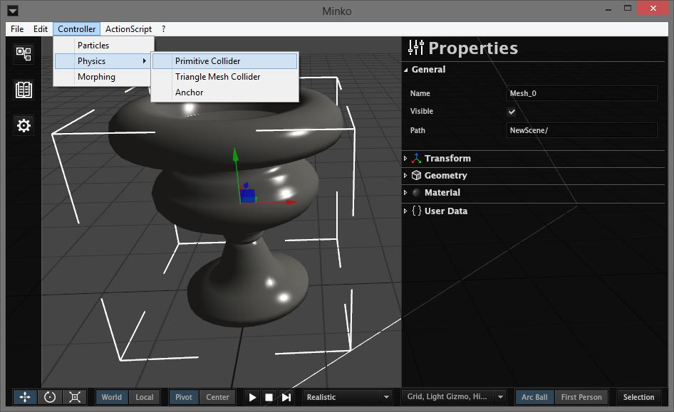
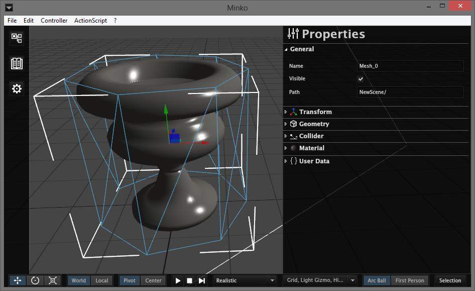
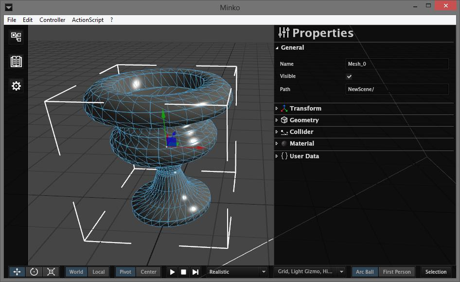

The Minko editor provides you with a way to add physic properties to your nodes, and get a preview of how each of your physical elements will interact with each other.

Adding a collider to a node
===========================

Colliders can be added to any node of a scene : meshes, cameras, lights or groups. Select a node in the scene tree, then in the application menu go to `Controller-> Physics`. There, you can choose between `Primitive Collider` or `Triangle Mesh Collider`.

-   `Primitive Collider`: this type of collider can be added to any node, and will have a primitive shape: `box`, `ball`, `cone` or `cylinder`.
-   `Triangle Mesh Colliders`: can be added to meshes only, and will generate a collider fitting the mesh geometry. For performance, it is recommended to use these type of colliders for static colliders only, and only when absolutely necessary. It is preferable to use a primitive collider instead, or to try and break a complex `triangle mesh collider` into multiple `primitive colliders`.

Here is a mesh with a cylinder `primitive collider`:

Here is the same mesh with a `triangle mesh collider`:

Collider properties
===================

Once a node has a collider, a `Collider` section will appear in its `Properties` panel. From there, you can change its shape, size and physic properties.

Collider type (primitive colliders only
---------------------------------------

You can choose between four different shapes for a primitive collider :

-   `Box`: your collider will have the shape of a cube. This is the default type. The box will automatically englobe the node.
-   `Cone`
-   `Ball`
-   `Cylinder`

Static
------

Static colliders will remain motionless in the scene, but other colliders will still collide with them. Static colliders are useful for floors, walls or any object in the scene that is supposed to remain in place.

To set a static collider, simply check the `Static` checkbox.

Enable rotation
---------------

Unchecking this box will disable rotation on your collider. It is useful for preventing a collider from falling forward, for example for a character that is only supposed to translate, keeping the same orientation.

Enable sleep
------------

If a collider remains motionless enough for a certain amount of time, it will fall asleep, remain in place and no computation on its speed will be made until another collider comes colliding with it. You can disable this behavior by unchecking `Enable Sleep`.

Shape
-----

In this subform, you can change the size, position and orientation of your collider.

### Scale

The scale components can be used to change the size of your collider.

On a `Box` collider, scale `x`, `y` and `z` will behave much like they would on a mesh transform.

On `Cone` and `Cylinder` colliders, scale `z` is disabled. Scale `x` will change the radius of the cylinder or the radius of the cone base, while scale `y` will change the height.

On `Ball` colliders, only scale `y` is enabled, and it will change the sphere radius.

### Translation

Translation will behave exactly like it would for the transform of a mesh.

### Rotation

Rotation will behave exactly like it would for the transform of a mesh.

Material
--------

This will define the physic properties of a collider

### Density

A bigger `density` will result in an heavier collider. The mass is computed from the `density` and the volume of a collider.

### Restitution

This will affect the restitution of forces when the collider collides with another collider. With higher values, the collider will "bounce" more when colliding with another collider.

### Friction

This will affect the loss of force when two colliders are in contact with each other. Lower friction levels will result in colliders "sliding" more easily with each other.

Logic
-----

### Trigger

When checked, this collider will trigger a signal when in collision with another collider. Other colliders will pass throught the collider without colliding with it.

Only `static` colliders can be `trigger` colliders.

### Group and Mask

You can use `Group` and `Mask` if you want colliders to only interact with a certain type of other colliders.

For example, if you have a `layer` called "floor" for all the floors, you will check "floor" in the `Group` selector of each collider corresponding to the floor. For each other collider that needs to collide with the floor (characters, etc...), you will check "floor" in their `Mask` selector.

If you want to link `Group` and `Mask` (for example if you have a set of colliders that would only interact with each other), check the `Bind group and Mask` checkbox.

Playing a physics simulation
============================

You can have a preview of how your physics colliders will interact with each other. For this just press the `play` button in the bottom bar.

To reset the physics world and the nodes at their original place, press the `stop` button.

