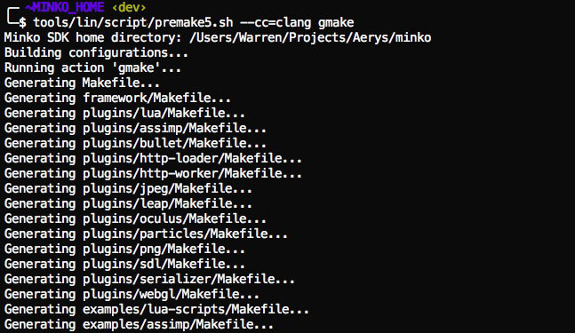

**The following tutorial assumes you are using a supported platform and that your environment is already set up to build Minko applications.**

Step 1: Get the SDK sources
---------------------------

Make sure you have the source code of Minko on your filesystem. You can get them from our repository: [Installing the Minko SDK sources](../tutorial/Installing_the_SDK.md).

Step 2: Installing the toolchain
--------------------------------

If you've never build a Minko application or the Minko SDK for OSX before, follow the [step 1 of the Targeting OSX tutorial](../tutorial/Targeting_Windows.md#step-1-install-the-toolchain).

Step 3: Generate the solution
-----------------------------

Minko uses Premake for its build system. Premake is a nice solution to have a cross-platform build system that can work across multiple IDEs such as Xcode, Visual Studio and even GNU Make. In order to build the SDK for OSX, we will generate a solution for `gmake`. We need to use a terminal to generate a `Makefile`-compatible solution:

```bash
cd ${MINKO_HOME} tool/mac/scripts/premake5.sh gmake 
```


If we want to select your compiler, we can pass the `cc` option. Supported values are `gcc` and `clang`:

```bash
tool/mac/scripts/premake5.sh --cc=clang gmake 
```


To learn more about premake commands, run:

```bash
tool/mac/scripts/premake5.sh help 
```




The list of the projects may vary according to the actual version of the SDK. What's important is to make sure that you have a `Makefile` at the root of the SDK and in each project directory.

Step 4: Compile the SDK
-----------------------

From the root directory of the SDK, simply run `make` with a valid configuration for your platform:

```bash
make config=osx64_release 
```


Valid configurations for `gmake` are:

-   `osx64_release`
-   `osx64_debug`

To leverage multi-core systems, you can also use `make -j`. The following example will use 4 cores and will compile the SDK much faster as a result:

```bash
make -j4 config=osx64_release verbose=1 
```


Step 5: Package
---------------

The SDK is now built, but you might want to share or copy it so you don't have to deal with the sources again. We use a script to produce a distributable SDK.

```bash
tool/mac/scripts/premake5.sh dist 
```


This should produce an archive in the root of the SDK which contains all the binaries built for your platform.

Step 6: Enjoy!
--------------

Now use your SDK to [Create a new application](../tutorial/Create_a_new_application.md).

