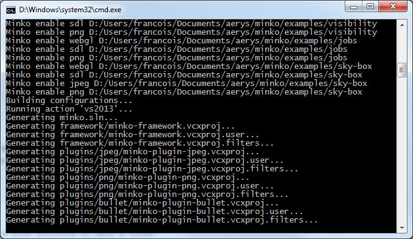

This tutorial will guide through the few steps to compile the Minko SDK using Visual Studio 2013. It has been tested on the following VS2013 distributions:

-   Visual Studio 2013 Express
-   Visual Studio 2013
-   Visual Studio 2013 Ultimate

Step 1: Get the sources
-----------------------

Make sure you have the source code of Minko on your filesystem. You can get them from our repository: [Installing the Minko SDK sources](../tutorial/Installing_the_SDK.md).

Step 2: Install the dependencies
--------------------------------

If you've never build a Minko application or the Minko SDK for Windows before, follow the [step 1 of the Targeting Windows tutorial](../tutorial/Targeting_Windows.md#step-1-install-the-toolchain).

Step 3: Generating the Visual Studio Solution
---------------------------------------------

Minko's SDK uses premake5, which is embed in the SDK, for its build system. Premake is a nice solution to have a cross-platform build system that can work with multiple IDEs such as XCode, Visual Studio and even gmake. To work with Minko's SDK, we will have to use premake to generate a Visual Studio solution.

To do this you can:

-   Run the following script from the "%MINKO_HOME%\tools\win\scripts" directory

```bash
premake_vs2013.bat
```


-   **Or** open a command line prompt in the root directory of the SDK and run:

```bash
tool/win/bin/premake5.exe --no-tests vs2013 
```


In both cases, you should have the following result in the console:



The windows might actually close itself right after it's done and the list of the projects may vary according to the actual version of the SDK. What's important is to make sure that the solution (*.sln) and projects (*.vcxproj) files have been properly generated. If this operation was successful, you should have `minko.sln` at the root of the SDK directory and a `*.vcxproj` in each projet.

Step 4: Compile the SDK
-----------------------

The Minko SDK is now ready. Open the solution file `minko.sln` generated at the root of the SDK and then just hit F7 to build the solution or F5 to build and start the default example project.

Step 5: Package (optional)
--------------------------

The SDK is now built, but you might want to share or copy it so you don't have to deal with the sources again. We use a script to produce a distributable SDK. Open a terminal at the SDK root and run:

```bash
tool\win\bin\premake5.exe dist 
```


This should produce an archive in the root of the SDK which contains all the binaries built for your platform.

Step 6: Enjoy!
--------------

Now use your SDK to [Create a new application](../tutorial/Create_a_new_application.md).

