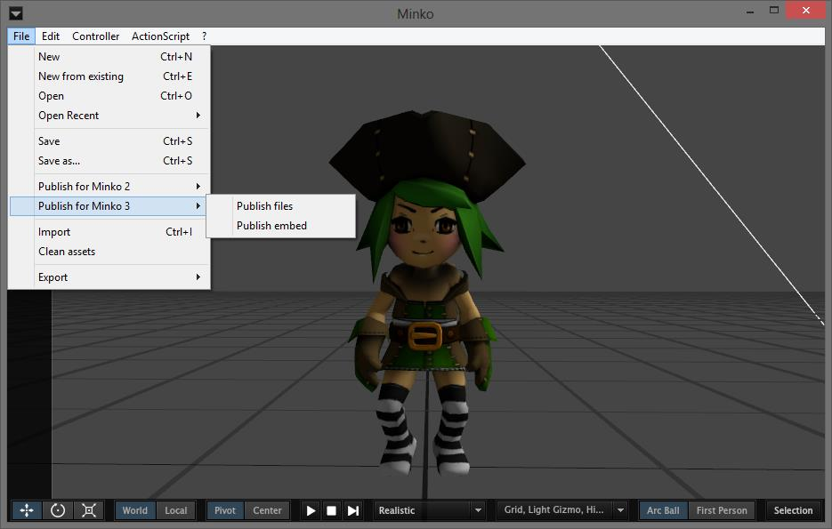

Step 0: Get the latest version of Minko Studio
==============================================

In order to publish `.scene` files, you will need at least a recent version of Minko Studio. You should be prompted for an update when you launch Minko, or you can get the latest version [here](http://minko.io/product-category/minko-studio/).

Step 1: Export a .scene file from Minko Studio
==============================================

You can now export `.mks` files to the new serialized format used in Minko 3.

You can choose between two exporting modes: files and embed. To export your scene, go into `Files-> Publish for Minko 3-> Publish files / Publish embed`

#### Files mode

By default, all assets (materials, geometries, textures) will be exported to separate files. The `.scene` file will reference them all as dependencies. This mode is good if you want to load parts of your scene only when needed, or if you want to edit a single texture file or replace a material with another on the fly, without the need to re-export everything.

#### Embed mode

In this mode, all assets will be embedded in the `.scene` file.

Step 3: Import .scene files in Minko 3
======================================

You can then use your `.scene` file in a Minko 3 application. See [Load .scene files](../tutorial/07-Loading_.scene_files.md) for more information.

