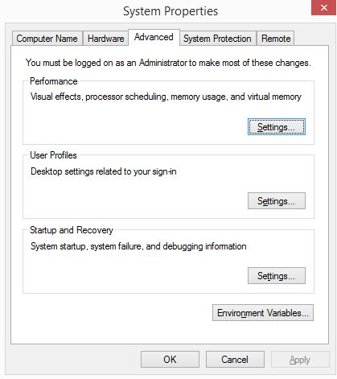
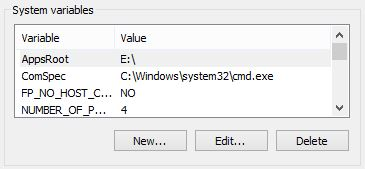

The SDK is only available as source code. You will have to compile it from our repository.

If you don't want to bother with Git, you should simply [Download an archive of the source code](https://github.com/aerys/minko/releases) and go to [Step 4](Installing_the_SDK.md#step-4-setup-your-environment).

Step 1: Install a Git client
----------------------------
The source code of Minko is available on [GitHub](https://github.com). This is an easy and elegant way for us to share our work. If you're already familiar with classic VCS such as Subversion (SVN), Git should not be a problem for you. Only better. You can use the official Github client for Windows or for Mac if you're into social coding.

We also recommend [SmartGit](http://www.syntevo.com/smartgit/download.html) which is a really nice Git client for Windows/Mac. SmartGit is very cool because you can merge all your repositories into a single project and perform bulk actions on all of them. That's very useful when you work with Minko and some of its extensions and want to update everything!

But you should use your favorite Git client of course!

Step 2: Clone the Minko repository
----------------------------------

"Cloning" our repository means creating a local copy of our code base. To do this, you just need to use the the "clone" feature of your Git client and use the URI provided on the github repository page:


If you're working with GitHub for Windows/Mac, you can clone the repository simply by clicking on the "Clone in Windows" or "Clone in Mac" button on the repository start page:


The URI of the GitHub repository is: https://github.com/aerys/minko.git

Step 3 (optional): Switching to the 'dev' branch
------------------------------------------------

If you want to try the latest features and additions, you will have to switch to the 'dev' branch. This branch is where updates and fixes and pushed everyday. To switch branches, you must use your Git client. It's usually a "switch" button:


When you have found the "switch" button, you just have to select the 'dev' branch. Voilà, you have the latest sources of Minko and you can easily update them from the GitHub repository!

If you want to switch back to the stable branch, you can do the same operation and select the 'master' branch instead of the 'dev' one. But beware: each branch contains a different version of Minko and some APIs might be incompatible. Therefore, the projects you develop with the 'dev' branch might be incompatible with the 'master' branch.

Step 4: Setup your environment
------------------------------

You have to set an environment variable that will be used by Minko's build system to locate the SDK you just installed. You just have to set the `MINKO_HOME` environment variable to the actual path of the SDK. This is the path to the root of the SDK as you get if from the ZIP archive (or the GIT repository) and where you can actually find a file called `sdk.lua`.

### Windows

Go to Control Panel-> System-> Advanced system settings and click on "Environment Variables"



Then click on "New..." in the "System variables" panel (or in the "User variables" panel if you want to setup the SDK for your own user only)



The "New System Variable" window will open, enter the following settings:

-   Variable name : MINKO_HOME
-   Variable value : the path to the actual Minko SDK root folder on your file system (ex: "C:\minko-sdk" without quotes)

and press "OK". If it worked correctly the `MINKO_HOME` environment variable should now be in the list.

### Linux / OS X

Open a terminal and type or copy/paste the following command line

```bash
export MINKO_HOME=/path/to/the/minko/sdk 
```


This will **temporarily** set the `MINKO_HOME` environment variable. **To make sure this change permanent, add it to your shell .rc file** (ex: `~/.bashrc` if you are using bash). To do this, type or copy/paste the following command line in the terminal:

```bash
echo "export MINKO_HOME=/path/to/the/minko/sdk"->> ~/.bashrc 
```


Of course, you have to adapt this command line using the actual path of the Minko SDK on your system and the right target .rc file for your shell.

Step 5: Installing toolsets
---------------------------
Now the SDK sources are on your local machine, you can compile them. To do so, please read one of the following tutorials:

-   To target Windows, follow the [Compiling the SDK for Windows](../tutorial/Compiling_the_SDK_for_Windows.md) tutorial.
-   To target OSX, follow the [Compiling the SDK for OSX](../tutorial/Compiling_the_SDK_for_OSX.md) tutorial.
-   To target Linux, follow the [Compiling the SDK for Linux](../tutorial/Compiling_the_SDK_for_Linux.md) tutorial.
-   To target HTML5, follow the [Compiling the SDK for HTML5](../tutorial/Compiling_the_SDK_for_HTML5.md) tutorial.
-   To target iOS, follow the [Compiling the SDK for iOS](../tutorial/Compiling_the_SDK_for_iOS.md) tutorial.
-   To target Android, follow the [Compiling the SDK for Android](../tutorial/Compiling_the_SDK_for_Android.md) tutorial.

Step 6: Start coding!
---------------------
Now that's you've got the SDK set up, let's use Minko. Depending on host and target platforms, you have multiple choices to build a Minko application. Here's a collection of tutorials you might want to read:

-   [Targeting Windows](../tutorial/Targeting_Windows.md)
-   [Targeting OS X](../tutorial/Targeting_OS_X.md)
-   [Targeting Linux](../tutorial/Targeting_Linux.md)
-   [Targeting HTML5](../tutorial/Targeting_HTML5.md)
-   [Targeting iOS](../tutorial/Targeting_iOS.md)
-   [Targeting Android](../tutorial/Targeting_Android.md)
-   Targeting Flash (coming when Adobe [updates its compiler](https://github.com/adobe-flash/crossbridge/issues/28)...)

