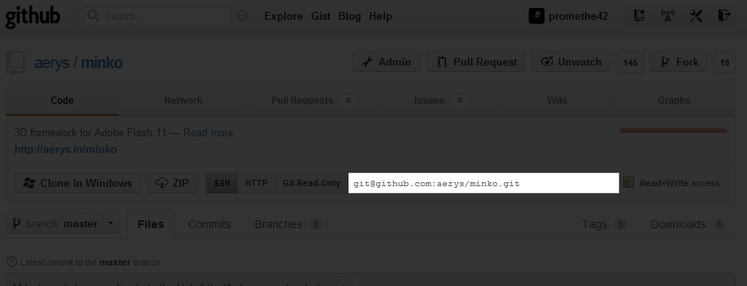
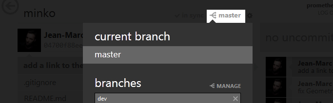

If you really want to start working with Minko, we strongly advise to work with the sources using Git. The first reason is that we add a lot of minor fixes and new features every day. You just have to read the commits list to see that we're very very active!

Another reason would be that it's much easier to understand the code if you're able to sneak in and see what it does. Most of the stuff you will use in your very first applications is very high level, and so is the corresponding implementation. It's cool to want to display a rotating cube in just 10 minutes. But it's even better if you can learn "what" the cube is actually "made of" in just one click and a few minutes of head scratching.

Step 1: Install a Git client
----------------------------

The source code of Minko is available on [Github](https://github.com). This is an easy and elegant way for us to share our work. If you're already familiar with classic VCS such as Subversion (SVN), Git should not be a problem for you. Only better. You can use the official Github client for Windows or for Mac if you're into social coding.

We also recommend [SmartGit](http://www.syntevo.com/smartgit/download.html) which is a really nice Git client for Windows/Mac. SmartGit is very cool because you can merge all your repositories into a single project and perform bulk actions on all of them. That's very useful when you work with Minko and some of its extensions and want to update everything!

But you should use your favorite Git client of course!

Step 2: Clone the Minko repository
----------------------------------

"Cloning" our repository means creating a local copy of our code base. To do this, you just need to use the the "clone" feature of your Git client and use the URI provided on the github repository page:

If you're working with GitHub for Windows/Mac, you can clone the repository simply by clicking on the "Clone in Windows" or "Clone in Mac" button on the repository start page:

The URI of the GitHub repository is : [here !](https://github.com/aerys/minko.git "here !")

Step 3 (optional): Switching to the 'dev' branch
------------------------------------------------

If you want to try the latest features and additions, you will have to switch to the 'dev' branch. This branch is where updates and fixes and pushed everyday. To switch branches, you must use your Git client. It's usually a "switch" button:

When you have found the "switch" button, you just have to select the 'dev' branch. Voilà, you have the latest sources of Minko and you can easily update them from the GitHub repository!

If you want to switch back to the stable branch, you can do the same operation and select the 'master' branch instead of the 'dev' one. But beware: each branch contains a different version of Minko and some APIs might be incompatible. Therefore, the projects you develop with the 'dev' branch might be incompatible with the 'master' branch.

Where to go from there...
-------------------------

Now the SDK sources are on your local machine, you can compile them. To do so, please read one of the following tutorials:

-   To target Windows, follow the [Compiling the SDK for Windows](../tutorial/Compiling_the_SDK_for_Windows.md) tutorial.
-   To target OSX, follow the [Compiling the SDK for OSX](../tutorial/Compiling_the_SDK_for_OSX.md) tutorial.
-   To target Linux, follow the [Compiling the SDK for Linux](../tutorial/Compiling_the_SDK_for_Linux.md) tutorial.
-   To target HTML5, follow the [Compiling the SDK for HTML5](../tutorial/Compiling_the_SDK_for_HTML5.md) tutorial.
-   To target iOS, follow the [Compiling the SDK for iOS](../tutorial/Compiling_the_SDK_for_iOS.md) tutorial.

