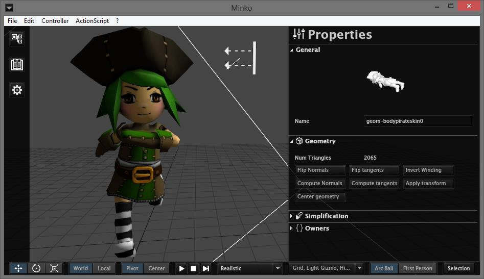
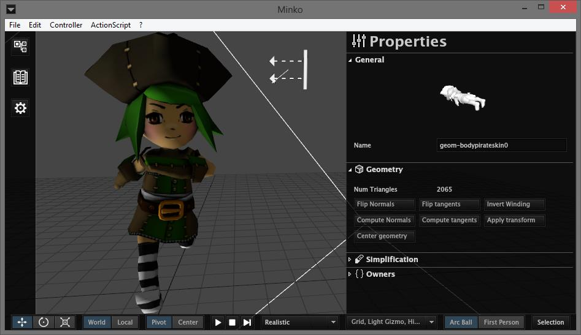
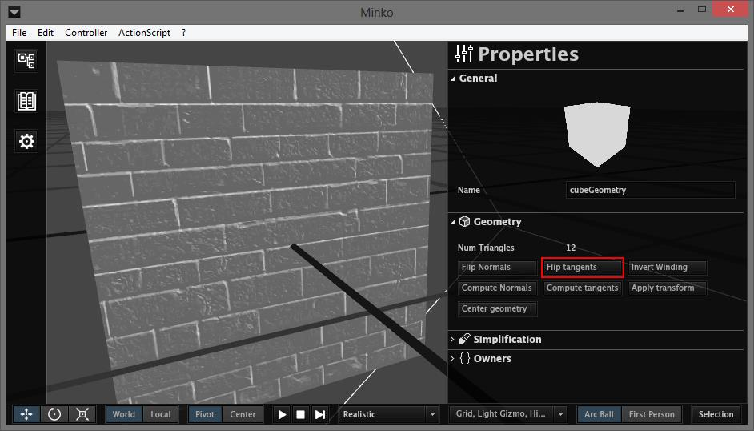
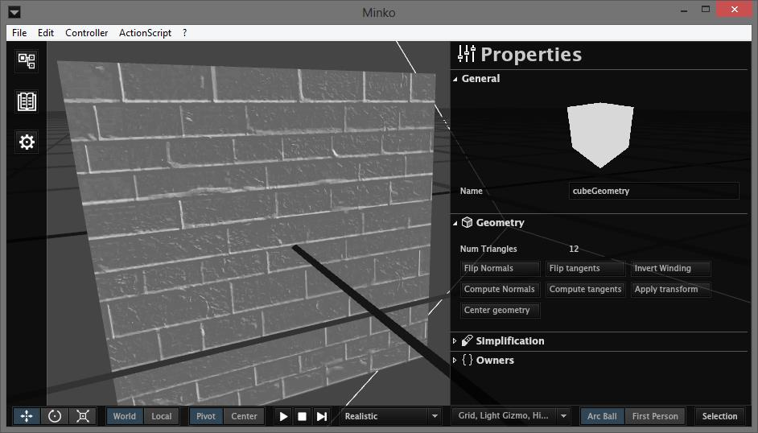
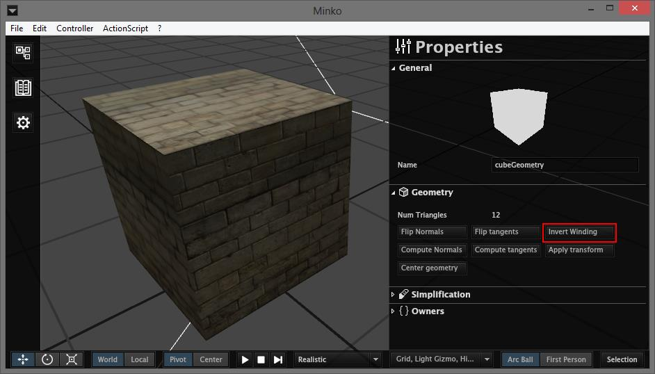
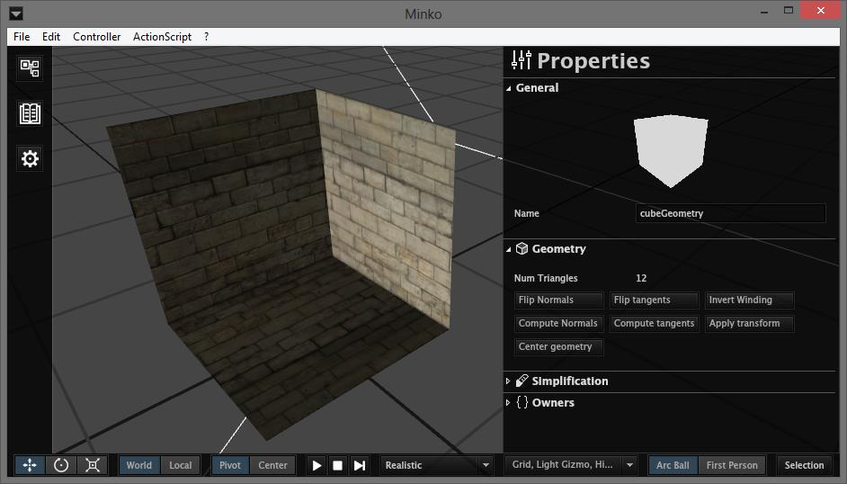
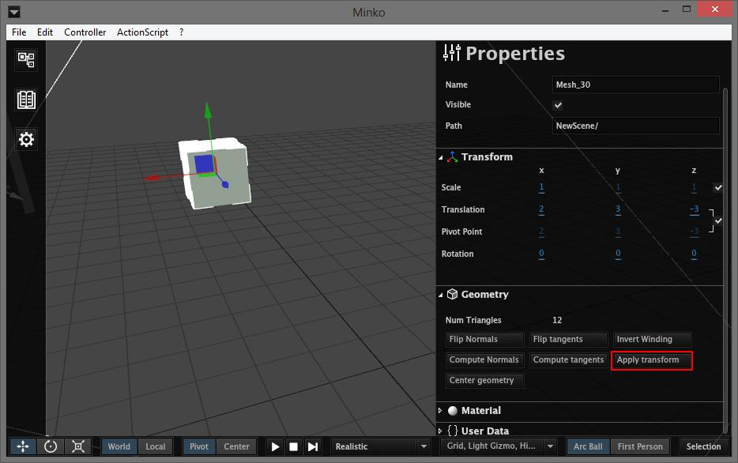
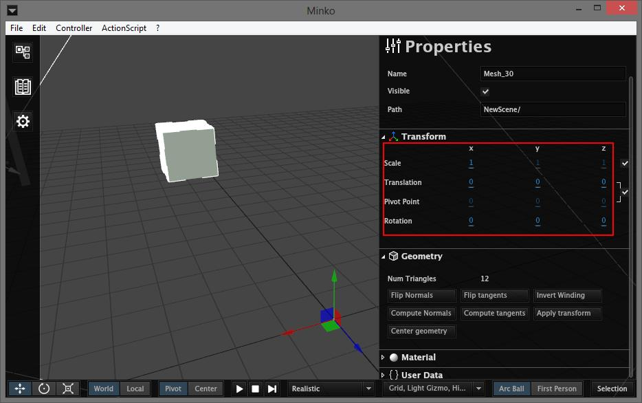
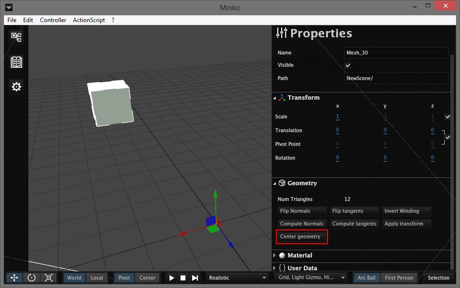
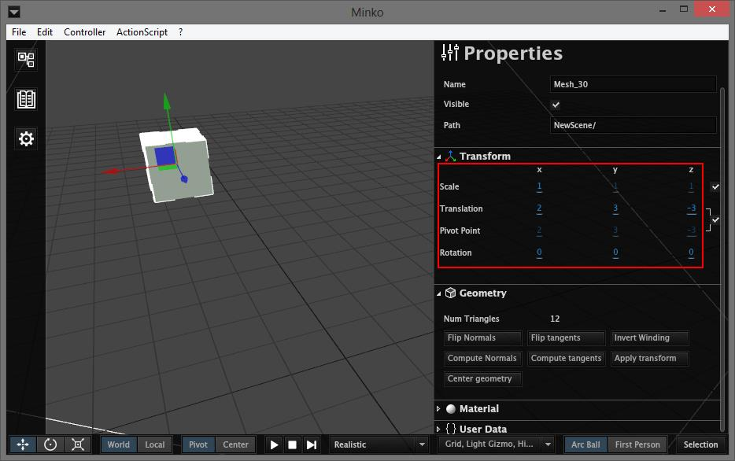

The `Geometry` section of the `Properties` panel provides a set of operations you can perform on geometries.

Flip normals
============

This will invert all normals of your geometry. Normals will impact the light effects on a surface.

-   Default normals

-   Flipped normals

Flip Tangents
=============

This will invert the tangents of your geometry. Tangents are used with the normal maps of your materials.

-   Default tangents

-   Flipped tangents

Invert winding
==============

This will invert the winding of each triangle of the geometry.

-   Default winding

-   Inverted winding

Compute Normals
===============

This will automatically compute the normals of the geometry.

Compute Tangents
================

This will automatically compute the tangents of the geometry.

Apply Transform
===============

If you select a mesh node, you can apply its transform to the geometry it uses. It will duplicate the geometry and apply the mesh transform to it. The selected mesh will then use this new geometry and its transform will be set to identity.

-   Default cube geometry

-   Cube geometry with the mesh tranform applied to it

Center Geometry
===============

This will set the geometry origin to the center of its bounding box. If a mesh uses this geometry, its transform will be changed so that the geometry keeps its place in space.

-   Offseted geometry

-   Centered geometry

