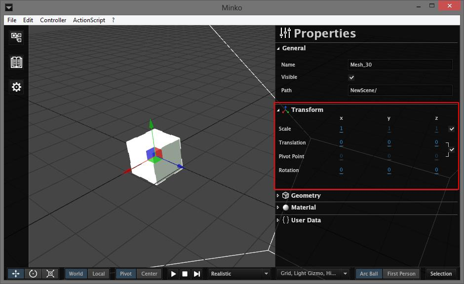
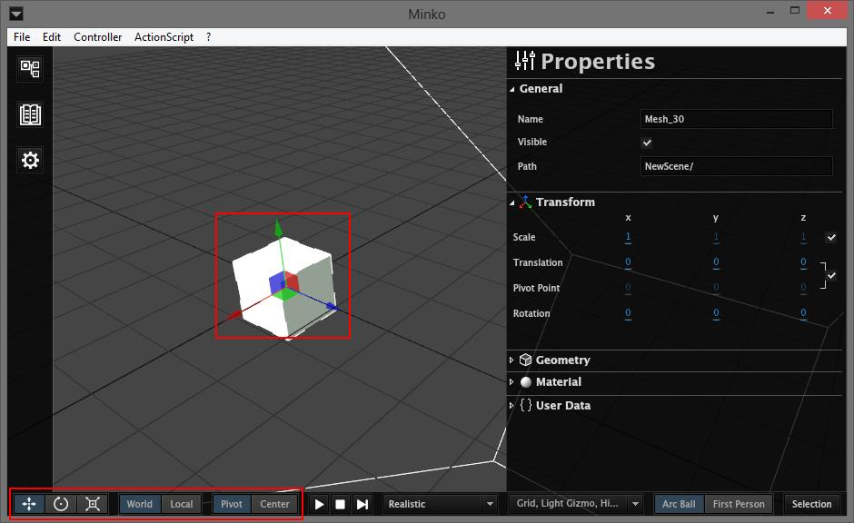

There are two ways of changing the transform of your nodes :

-   Through the `Properties` panel
-   With the gizmos on the scene

In order to change the transform of a node, you have to select this node, either by clicking on it on the scene, or by clicking on it on the scene tree of the `Scene` panel.

Transform section on the Properties panel
=========================================

The `Transform` section of the `Properties` panel allows you to alter 4 characteristics of the transform.

#### Scale

The scale changes the size of a node. By default, the scale is uniform, this means the same scale will be applied on all 3 axis, and changing the X scale of the node will change its size.

If you uncheck the checkbox on the right, you will see that the scale Y and Z are now enabled and you can change the scale on all three axis distinctively.

#### Translation

This allows you to move the selected node in the space, relatively to its parent.

#### Pivot Point

This is the rotation pivot point. By default, it follows the node translation, but if you untick the checkbox on the left, you can dissociate the two and specify a different pivot point.

#### Rotation

This will rotate your node around the pivot point.

Transform Gizmos
================

When a node is selected on the scene, you will notice there is a gizmo placed at its origin. You can use it to move your node in a more visual way than with the form. It also makes it easier to move a node that is included in transformed group.

To switch between gizmos, use the three buttons on the left of bottom bar. See the [bottom bar](../tutorial/The_bottom_bar.md#transform-gizmos) tutorial for more details.

#### Translation

The transform gizmo has 3 arrows, that you can use to move your node along the X, Y and Z axis, and 3 planes between those arrows, to move the node along two axis at the same time.

To use it, place your mouse over one of the arrows or one of the planes, that will become yellow. Then click and drag with your mouse to move the node.

#### Rotation

With the rotation gizmo, you can rotate a node using the 3 circles. Click and drag your mouse on either three of the circles to rotate the node along the desired axis.

#### Scale

Finally, the scale gizmo will allow you to change the scale along one of the 3 axis. If the node is in uniform scale mode, all three axis will be scaled when you adjust the scale of one axis.

#### Spacial reference

By default, all gizmos will move your node in world space, wether they're at the root of the scene or in a number of subgroups with different transforms. You can switch to local space, with the `World/Local` button on the bottom bar, if you want to move your node in local space.

#### Pivot Point

By default, for the rotation, the center of the node will be used as pivot point. You can switch this to the pivot point of the node with the `Center/Pivot` button of the bottom bar. In pivot mode, the pivot point will be either the node's pivot point if it is set, or the node origin.

