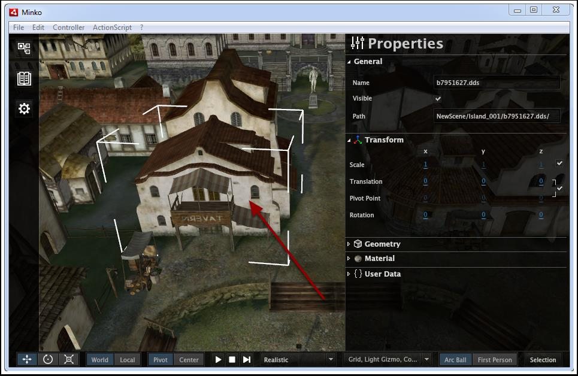
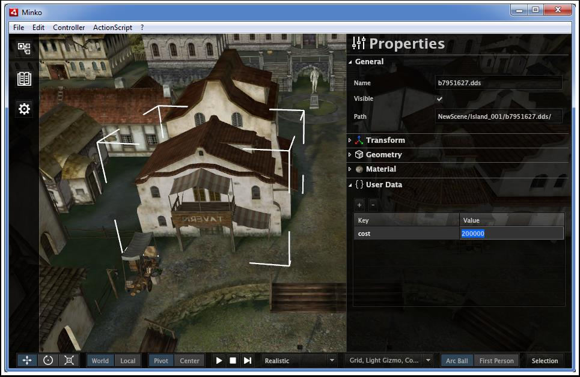

You can set your custom properties directly from the editor, and export them in your .mk file, so they can be automatically loaded in the `userData` property.

-   Select a node

-   Open the User Data panel

-   Click on the '+' button

-   Set the property name and the property value

