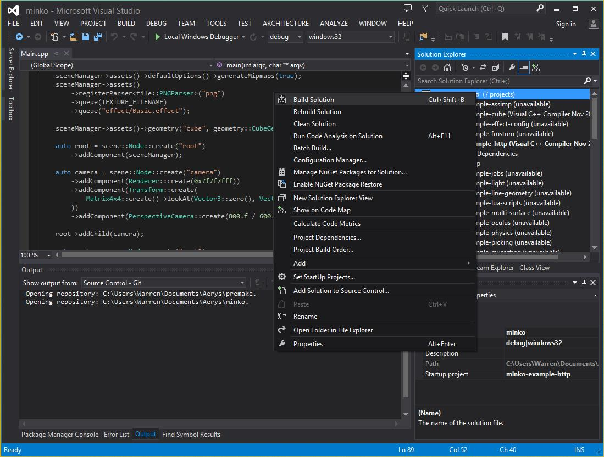

This tutorial requires that your have read [Create a new application](../tutorial/Create_a_new_application.md). We'll suppose your application is named `my-project`.

Step 1: Install the toolchain
-----------------------------

Windows doesn't come with a C++ compiler, we'll have to install it by ourselves. On Windows, Minko supports only Visual Studio 2013 at the moment. We recommend [Visual Studio 2013 Express for Windows](http://www.visualstudio.com/en-us/products/visual-studio-express-vs.aspx).

Though Minko works fine without it, we also suggest upgrading to the new compiler, named [CTP November 2013](http://www.microsoft.com/en-us/download/details.aspx?id=41151), provided for free by Microsoft. This is documented in [Compiling the SDK with Visual Studio 2013](../tutorial/Compiling_the_SDK_for_Windows.md#step-3-generating-the-visual-studio-solution).

Step 2: Generate the solution
-----------------------------

To generate a solution, run the following script:

```bash
script\solution_vs2013ctp.bat 
```


This should generate a `.sln` Visual Studio solution file. Double-click on it to open the solution in Visual Studio 2013.

Note that you can also run the command from a terminal in your application directory (<kbd>Shift</kbd> + Right click on the folder-> `Open command window here`), which will allow you to customize your solution, such as [enabling specific plugins using the command line](../tutorial/How_to_enable_a_plugin.md#step-2-alternative-enable-a-plugin-in-the-command-line):

```bash
"%MINKO_HOME%"\tool\win\bin\premake5.exe vs2013ctp 
```


Step 3: Build the solution
--------------------------

On the top of Visual Studio, two menus are available, one with the available platforms and one with the configurations. There are 4 supported Windows configuration:

-   `windows32_release`
-   `windows32_debug`
-   `windows64_release`
-   `windows64_debug`

Typically, we want to target `windows32` / `release`. Note that on Windows, the performance difference between release and debug builds is huge.

Right-click on your solution and run Build Solution.



Step 4: Run the application
---------------------------

Let's run the application. Right-click on the project and run Debug / Start a new instance. This should open a terminal window and a rendering window with your application.

You will find the executable with the required DLLs in the `bin/windows32/release` directory depending on your current configuration.

Step 5: Clean the solution (optional)
-------------------------------------

To clean the build, right-click on the solution and run Clean Solution.

If you also want to erase generated solution files (`.sln`, `.vcxproj` files), you can use a stronger command which will erase any ignored file (files matched by a pattern in `.gitignore`):

```bash
script\clean.bat 
```


Step 6: Support more targets (optional)
---------------------------------------

Your application should now target Windows in one click. You can also [turn your native application into an HTML5 one](../tutorial/Targeting_HTML5.md)!

