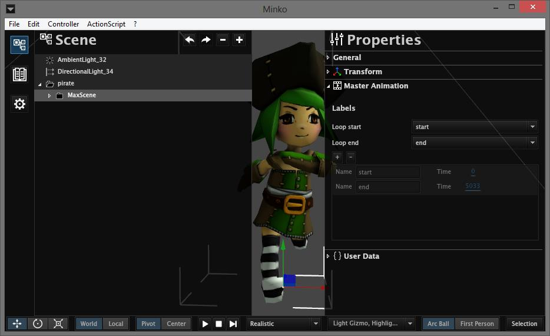
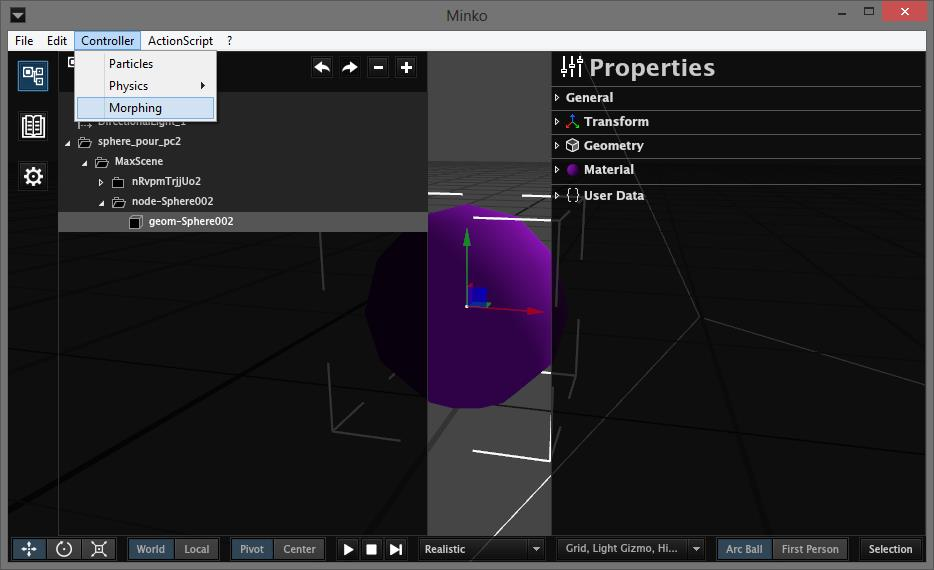
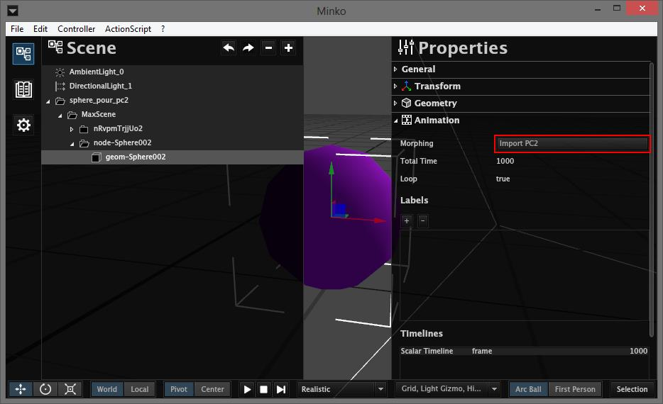
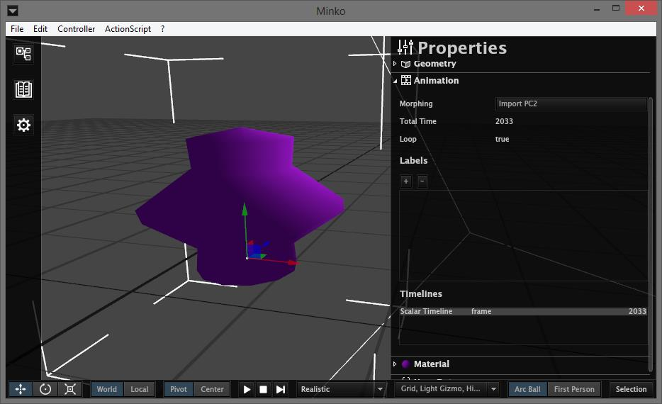
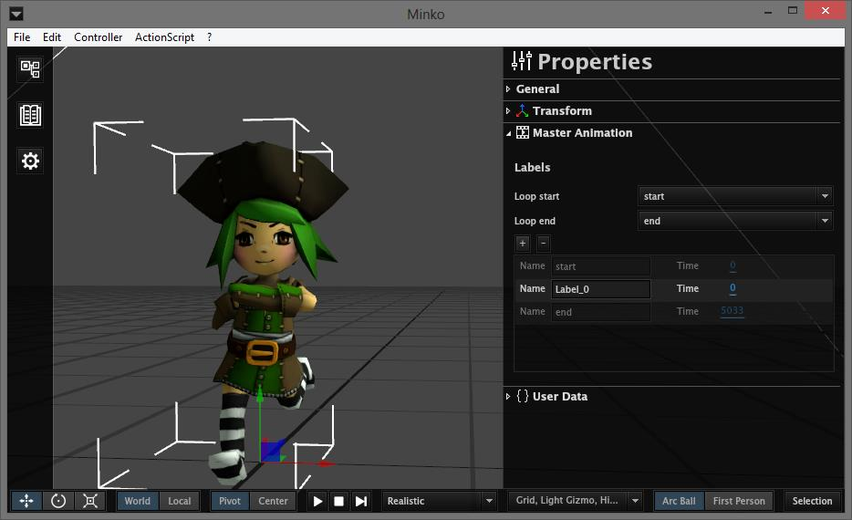
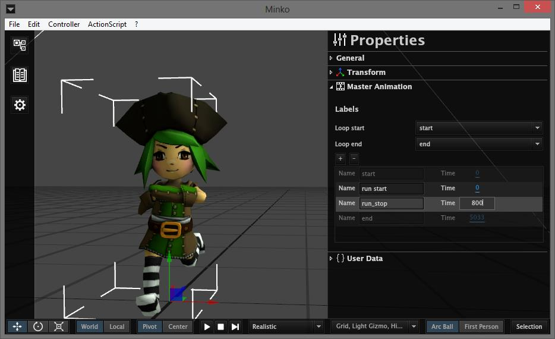
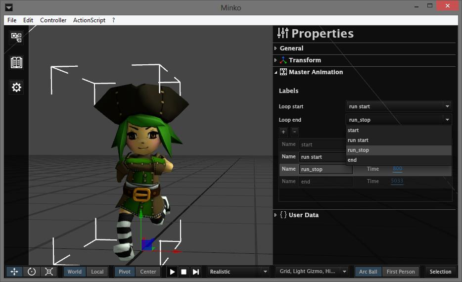

Step 1: Importing an animation
==============================

If you are importing a `collada` file (`.dae`), the animations that are present in that file will be imported with the symbol.

### Importing animations from a collada file

If you haven't already, please read the [Importing assets](../tutorial/Import_assets.md) tutorial. After importing your collada file, add a new instance of the symbol in your scene. Then, either unlink the symbol or go inside it.

You should see a `Master Animation` section in the `Properties` panel when you select the root node of your symbol. This is where you will be able to add and to manipulate labels.

### Importing PC2 animations

For other formats, you can import animations with the `.pc2` format.

#### Adding a morphing controller to the node

Once the node that will take the `pc2` animation in your scene, select that node, and add the morphing controler by selecting `Controller-> Morphing` from the menu bar.

#### Importing the pc2 file

You will then notice an `Animation` section appeared on the `Properties` panel of your node. Open it and click `Import PC2`

Select the `pc2` file. Your node can now play the animation you imported, you can notice the new line in the `Timelines` table.

Step 2: Adding labels
=====================

If your animations have several parts, you will need to be able to play these different parts independently. This is easily done by adding labels corresponding to different.

In the `Animation` or `Master Animation` section, click the `+` button above the `Labels` table. A new label will be added with a default name and set at time 0.

Add a label for each animation loop start/end point, and for any key moment you want.

Step 3: Using the labels
========================

You can select the loop start and end point when you play an animation in the editor. This is only for checking that your label times are good and will not affect the saved or published file.

Select the labels in the `loop start` and `loop end` drop-down lists, then hit play in the bottom bar.

