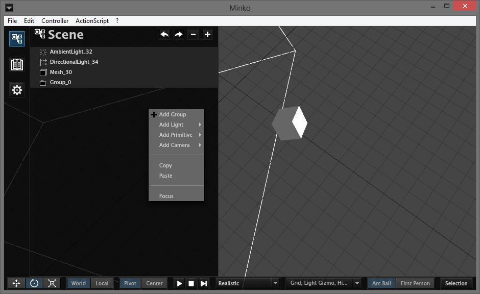

The scene tree gives you an overview of what is is your scene. It also allows you to add groups, lights, cameras and to move nodes in the hierarchy.

Focus
=====

On every node, you can click `Focus` on the right click menu to focus the camera on that node.

Adding nodes
============

Right click anywhere on the tree to add different types of nodes to the scene.

#### Add Group

A group can contain other nodes (of any type). A group can have a transform that will be added to any of its children

#### Add Light

With this submenu, you can add one of the following types of lights :

-   Directional light
-   Ambient light
-   Spot light
-   Point light

For more details on each of these types of light, see the [Working with lights](../tutorial/25-Working_with_ambient_lights.md) tutorial.

#### Add Primitive

With this submenu, you can add one of the following primitives to your scene :

-   Cube
-   Sphere
-   Plane
-   Cylinder
-   Cone
-   Torus

#### Add Camera

With this submenu, you can add one of the following cameras :

-   Projection Camera
-   Orthographic Camera

Copying nodes
=============

You can copy one of multiple nodes, and paste them elsewhere. You can either use the right click menu and select `Copy`/`Paste`, or the `Ctrl + C`(copy) `Ctrl + V`(paste) keyboard shortcuts, either on the scene tree or on the scene.

Node specific actions
=====================

Some type of nodes have specific actions associated to them, accessible through the right click menu.

Mesh nodes
----------

#### Apply transform to geometry

This command will clone the mesh geometry and apply the mesh transform to the geometry, so that the mesh transform is set to the identity.

Group nodes
-----------

#### Create Symbol

This will create a symbol from the group and add it in the assets library to be used as a symbol. The group will be replaced by an instance of the newly created symbol.

#### Flatten

This will remove all sub-groups to have all leaf nodes as children of the group.

#### Fit content

This will set the group transform to be at the center of its bounding box englobing all of its children. All children transforms will be changed to keep the same world position.

Symbol nodes
------------

#### Unlink from asset

This will replace the instance of the symbol with a group containing the symbol content. Any modifications of the symbol will no longer alter this unlinked group.

Editing a symbol
================

You can enter a symbol in order to make modifications to it. For this, you can either double-click on an instance of the symbol in the tree, or select it and click on the `Enter Symbol` button above the tree (arrow going to the right).

Once your modifications are finished, you can leave the symbol by clicking on the `Leave Symbol` button above the tree (arrow going to the left).

Unfolding all nodes
===================

Use the `+` and `-` buttons above the scene tree to fold or unfold every group in the scene.

